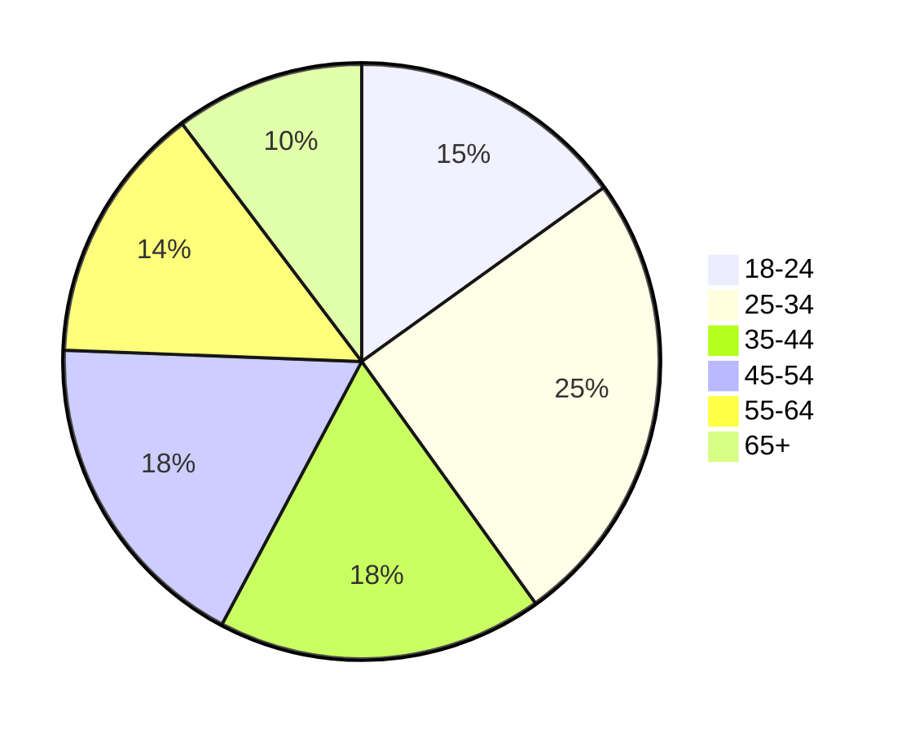

# Avito

## Содержание

- [Avito](#avito)
  - [Содержание](#содержание)
  - [Основная часть](#основная-часть)
    - [1. Тема и целевая аудитория](#1-тема-и-целевая-аудитория)
      - [Функционал MVP](#функционал-mvp)
      - [Ключевые продуктовые решения](#ключевые-продуктовые-решения)
      - [Целевая аудитория](#целевая-аудитория)
        - [Анализ трафика и вовлеченности](#анализ-трафика-и-вовлеченности)
        - [Веб-трафик по странам](#веб-трафик-по-странам)
        - [Демографические показатели](#демографические-показатели)
          - [Распределение по полу](#распределение-по-полу)
          - [Возрастной состав](#возрастной-состав)
        - [Устройства](#устройства)
    - [2. Расчет нагрузки](#2-расчет-нагрузки)
      - [Продуктовые метрики](#продуктовые-метрики)
      - [Технические метрики](#технические-метрики)
        - [Размер хранилища одного пользователя](#размер-хранилища-одного-пользователя)
        - [RPS по типам запросов](#rps-по-типам-запросов)
        - [Нагрузка на сеть по типам запросов](#нагрузка-на-сеть-по-типам-запросов)
          - [Итог](#итог)
  - [Список источников](#список-источников)

## Основная часть

### 1. Тема и целевая аудитория

**Avito** - сервис, где каждый может предложить или найти товар или услугу.

#### Функционал MVP

1. Регистрация и авторизация пользователей
2. Размещение и редактирование объявлений (фото, выбор категории, описание, цена, выбор доставки)
3. Создание отзыва о товаре/услуге
4. Модерация объявлений (текста и фотографий) и отзывов
5. Чат между покупателем и продавцом (отправка, получение и просмотр сообщений)
6. поиск товара или услуги по параметрам через
   - полнотекстовый поиск
   - категории
   - карты
7. просмотр рекомендаций товаров и услуг

#### Ключевые продуктовые решения

TODO

#### Целевая аудитория

##### Анализ трафика и вовлеченности

- Всего посещений (за месяц): **310.5M** [^1]
- Доля пользователей, покинувших сайт после просмотра одной страницы: **25.11%** [^1]
- Страниц на посещение: **12.80** [^1]
- Средняя продолжительность посещения: **00:11:29** [^1]
- **53 млн** активных пользователей в месяц [^1]
- **63%** продавцов Avito договариваются с клиентами устно или в переписке [^1]
- Avito посещают **36%** россиян каждый месяц [^1]

##### Веб-трафик по странам

|  **№**  | **Страна**     | **Пользователи** |
| :-----: | -------------- | ---------------- |
| 1 | Россия | 96.7% |
| 2 | Германия | 0.5% |
| 3 | Украина | 0.46% |
| 4 | Беларусь | 0.42% |
| 5 | Нидерланды | 0.36% |

##### Демографические показатели

###### Распределение по полу

- Мужчины: **64.11%** [^1]
- Женщины: **35.89%** [^1]

###### Возрастной состав

##### Устройства

- Десктоп: **47%** [^1]
- Мобильный: **53%** [^1]

### 2. Расчет нагрузки

#### Продуктовые метрики

| **Метрика** | **Значение** |
| ----------- | ------------ |
| MAU | 53 млн [^1] |
| DAU | 1.7 млн [^1] |
| Посещений | 314 млн [^1] |
| Продолжительность посещения | 00:11:29 [^1] |
| Создается объявлений | 1.4 млн [^1] |
| Активных объявлений | 237 млн [^2] |
| Картинок в хранилище | 28 миллиардов [^2] |
| Модерация | 15 млн версий объявлений в день [^2] |
| Сделок в секунду | 10 [^2] |
| Картинок в хранилище | 28 млрд [^2] |
| Сообщения | 40 тыс в минуту [^1] |
| Беседы | 10 тыс в минуту [^1] |

#### Технические метрики

##### Размер хранилища одного пользователя

| **Данные** | **Количество** | **Объем** |
| ---------- | ---------------| --------- |
| Пользователь | 1 | 19 КБ |
| Объявление (данные, изображения) | 5 | 15 МБ |
| Отзыв | 10 | 10 КБ |
| Сообщение в чате | 100 | 10 КБ |

- Пользователь (**1** профиль на пользователя)
  - персональные данные: **1 КБ**
  - аватарка: если считать, что аватарку загружают **60%** всех пользователей и одна аватарка **256x256** в формате JPEG весит **30 КБ**, то на одного пользователя приходится `1 * 0.6 * 30 = 18 КБ`
- Объявление: (**5** объявлений на пользователя)
  - данные о товаре/услуге: **1 КБ**
  - изображения: если считать, что одно объявление в среднем содержит **3** изображения и одно изображение формата JPEG весит **2 МБ**, то на одно объявление приходится **6 МБ**; после сжатия на сервере каждая фотография будет занимаеть не более **1 МБ**

Тогда при нагрузке в **70 млн** пользователей потребуется **1004 ТБ**.

##### RPS по типам запросов

| **Действие** | **Количество на пользователя в сутки** | **Общее количество в сутки** | **RPS** |
| ------------ | -------------------------------------- | ---------------------------- | ------- |
| Создание объявления | 0.8 | 1.4 млн | 16 |
| Редактирование объявления | 8 | 13.6 млн | 157 |
| Поиск товара/услуги | 7 | 11.9 млн | 138 |
| Получение рекомендаций | 7 | 11.9 млн | 138 |
| Просмотр объявления | 21 | 35.7 млн | 413 |
| Создание отзыва о товаре/услуге | 0.2 | 345.6 тыс | 4 |
| Просмотр отзывов о товаре/услуге | 14 | 23.8 млн | 276 |
| Отправка сообщения в чате | 17 | 28.9 млн | 335 |
| Получение сообщения в чате | 17 | 28.9 млн | 335 |

- Создание объявления: в сутки создается **1.4 млн** объявлений в день
- Редактирование объявления: **15 млн** версий объявлений в день проходят модерацию; если вычесть новые объявления, которых **1.4 млн**, то получится, что в сутки редактируется **13.6 млн** объявлений
- Поиск товара/услуги: будем считать, что каждый пользователь из DAU в среднем делает **7** поисковых запрсов, поэтому всего таким запросов будет приходить **11.9 млн** в сутки
- Получение рекомендаций: будем показывать рекомендации пользователю при каждом поисковом запросе, значит запросов на получение рекомендаций будет **11.9 млн** в сутки
- Просмотр объявления: считаем, что из **7** поисковых запросов пользователь зайдет на **3** объявления
- Создание отзыва о продавце/покупателе: будем считать, что отзыв оставляет **каждый пятый** пользователь; в секунду совершается **10 сделок**; сделка совершается между двумя пользователями, значит из **20 пользователей** отзыв оставят **4**
- Просмотр отзывов о продавце/покупателе: считаем, что пользователь при каждом из **7** поисковых запросов откроет страницу с отзывами **2 раза**, то всего таких запросов будет **14**
- Отправка сообщения в чате: пользователи отправляют **40 тыс** сообщений в минуту [^1]; если предположить, что пользователи отправляют сообщения только днем, то есть 12 часов в сутки, то на каждого пользователя приходится `40k * 60 * 12 / DAU = 17` сообщений в сутки
- Получение сообщения в чате: считаем, что пользователи отправляют сообщения только тем, кто входит в DAU

##### Нагрузка на сеть по типам запросов

| **Действие** | **Трафик на один действие, Кб** | **Пиковое потребление, Гбит/с** | **Суммарный суточный трафик, Тбайт/сутки** |
| ------------ | ----------------------------| ------------------------------- | ------------------------------------------ |
| Создание объявления | 6144 Кб | 0.81 | 8.70 |
| Редактирование объявления | 307 Кб | 0.40 | 4.26 |
| Поиск товара/услуги | 474 Кб | 0.54 | 5.79 |
| Получение рекомендаций | 350 Кб | 0.39 | 4.27 |
| Просмотр объявления | 214 Кб | 0.72 | 7.82 |
| Создание отзыва о товаре/услуге | 4 Кб | 0.0001 | 0.001 |
| Просмотр отзывов о товаре/услуге | 176 Кб | 0.39 | 4.29 |
| Отправка сообщения в чате | 2 Кб | 0.006 | 0.059 |
| Получение сообщения в чате | 2 Кб | 0.006 | 0.059 |

###### Итог

- Суммарное пиковое потребление: **3.26 Гбит/с**
- Суммарный суточный трафик: **35.25 Тбайт/сутки**

## Список источников

[^1]: [Статистика Avito за 2024 год](https://inclient.ru/avito-stats/)

[^2]: [AvitoTech Playbook](https://github.com/avito-tech/playbook)
