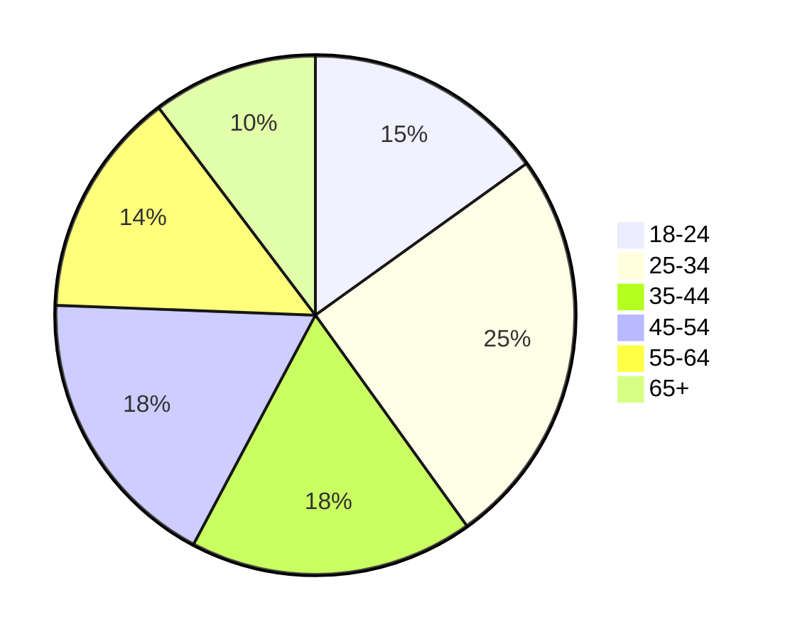

# Avito

## Содержание

- [Avito](#avito)
  - [Содержание](#содержание)
  - [Основная часть](#основная-часть)
    - [1. Тема и целевая аудитория](#1-тема-и-целевая-аудитория)
      - [Функционал MVP](#функционал-mvp)
      - [Ключевые продуктовые решения](#ключевые-продуктовые-решения)
      - [Целевая аудитория](#целевая-аудитория)
        - [Анализ трафика](#анализ-трафика)
        - [Веб-трафик по странам](#веб-трафик-по-странам)
        - [Демографические показатели](#демографические-показатели)
          - [Распределение по полу](#распределение-по-полу)
          - [Возрастной состав](#возрастной-состав)
        - [Устройства](#устройства)
    - [2. Расчет нагрузки](#2-расчет-нагрузки)
      - [Продуктовые метрики](#продуктовые-метрики)
        - [Предположения о продукте](#предположения-о-продукте)
        - [Средний размер хранилища одного пользователя](#средний-размер-хранилища-одного-пользователя)
          - [Пояснения](#пояснения)
          - [Результаты](#результаты)
      - [Технические метрики](#технические-метрики)
        - [RPS по типам запросов](#rps-по-типам-запросов)
          - [Пояснения](#пояснения-1)
        - [Нагрузка на сеть по типам запросов](#нагрузка-на-сеть-по-типам-запросов)
          - [Результаты](#результаты-1)
  - [Список источников](#список-источников)

## Основная часть

### 1. Тема и целевая аудитория

**Avito** - интернет-сервис для размещения объявлений о товарах, недвижимости, а также услугах от частных лиц и компаний, занимающий первое место в мирое среди сайтов объявлений.

#### Функционал MVP

1. Регистрация и авторизация пользователей
2. Размещение и редактирование объявлений (фото, выбор категории, описание, цена)
3. Создание отзыва о продавце/покупателе
4. Модерация текста и фотографий объявлений/отзывов с использованием ML-модели для автоматического выявления нарушений
5. Чат между покупателем и продавцом (отправка текста, прикрепление фотографий, получение и просмотр сообщений)
6. Поиск товара/услуги
   - по ключевым словам (полнотекстовый поиск)
   - по категориям
   - по геолокации
7. Рекомендации объявлений исходя из
   - объявлений, добавленных в избранное
   - объявлений, оцененных пользователем (поставил лайк)
   - оформленных покупок
   - поисковых запросов
   - региона и геолокации пользователя

#### Ключевые продуктовые решения

- Поиск объявлений товаров/услуг по картинке, используя ML-модель
- Добавление объявлений в избранное для их дальнейшего отслеживания
- Защита номера телефона продавца (переадресация звонка с виртуального телефонного номера продавца на реальный)

#### Целевая аудитория

##### Анализ трафика

- **62.3M** Monthly Active Users (MAU) [^1]
- **24.8M** Daily Active Users (DAU) [^2]
- **400К** новых объявлений в день [^2]
- **120** сделок в минуту [^1]
- более **230M** активных объявлений [^1]

##### Веб-трафик по странам

[^3]

| **№** | **Страна** | **Пользователи** |
| :-: | - | - |
| 1 | Россия | 96.7% |
| 2 | Германия | 0.5% |
| 3 | Беларусь | 0.42% |
| 4 | Нидерланды | 0.36% |

##### Демографические показатели

###### Распределение по полу

- Мужчины: **64.11%** [^3]
- Женщины: **35.89%** [^3]

###### Возрастной состав

[^3]

##### Устройства

- Десктоп: **22%** [^4]
- Мобильный: **78%** [^4]

### 2. Расчет нагрузки

#### Продуктовые метрики

| **Метрика** | **Значение** |
| - | - |
| MAU | 62.3M [^1] |
| DAU | 24.8M [^1] |
| Новых объявлений | 400K в день [^1] |
| Сделок | 120 в минуту [^1] |
| Активных объявлений | >230M [^1] |
| Картинок в хранилище | 28B [^5] |
| Модерация объявлений | 15M в день [^5] |
| Посещений avito.ru | 314M в месяц [^6] |
| Создается объявлений | 1.4M в день [^6] |
| Отправляется сообщений | 40K в минуту [^6] |
| Создается бесед | 10K в минуту [^6] |

##### Предположения о продукте

- Аватарку загружают **70%** MAU
  - в среднем одна аватарка формата **WEBP** в разрешении **256x256** весит примерно **15 КБ** (после обработки на сервере)
- На одного пользователя приходится **3** объявления в месяц
- К одному объявлению прикреплено **5** картинок фомрата **WEBP** объемом **50 КБ** (после обработки на сервере)
- Один пользователь в месяц оставляет
  - 5 отзывов о продавце/покупателе, содержащих **250** символов на русском языке в кодировке **utf-16**, где каждое весит **0.5 КБ**
  - 200 сообщений, содержащих **50** символов на русском языке в кодировке **utf-16**, где каждое весит **0.1 КБ**
- Каждый пользователь из DAU в среднем делает **7** поисковых запрсов в сутки
- Каждый пользователь из DAU посещает главную страницу **5** раз
- Отзыв о продавце/покупателе оставляет каждый **10-й** пользователь после совершения сделки
- Из **10** просмотренных объявлений пользователь откроет страницу отзывов **2** раза
- Количество регистраций составляет 5% от общего количества посещений (**314M** в месяц [^6])
- **15%** пользователям из DAU нужно авторизоваться
- Пользователь добавляет в избранное **1** объявление из **10** просмотренных
- **30%** отредактированных объявлений содержат **2** новые фотографии

##### Средний размер хранилища одного пользователя

| **Данные** | **Количество** | **Общий объем, Кб** |
| - | - | - |
| Информация о пользователе | 1 | 12 |
| Объявления | 5 | 756 |
| Отзывы | 5 | 2.5 КБ |
| Сообщения | 200 | 20 |

###### Пояснения

- Информация о пользователе
  - персональные данные: $1$ КБ
  - аватарка: $1 \times 0.7 \times 15 = 11$ КБ

- Объявление (3 на пользователя в месяц)
  - данные о товаре/услуге (описание, характеристики, адрес и т.д.): $3 \times 2 = 6$ КБ
  - картинки: $3 \times 5 \times 50 = 750$ КБ

- Отзывы (5 на пользователя в месяц)
  - текст: $5 \times 0.5 = 2.5$ КБ

- Сообщения (200 на пользователя в месяц)
  - текст: $200 \times 0.1 = 20$ КБ

###### Результаты

Тогда на одного пользователя потребуется **791 КБ** в месяц. При нагрузке в **62.3M MAU** необходимо **46 ТБ** памяти в месяц.

За год сервис накопит данных объемом **550 ТБ**.

#### Технические метрики

##### RPS по типам запросов

| **Действие** | **Количество на пользователя в сутки** | **Общее количество в сутки** | **Среднее RPS** | **Пиковое RPS** |
| - | :-: | :-: | :-: | :-: |
| Регистрация | 0.02 | 507K | 5.9 | 17.6 |
| Авторизация | 0.015 | 3.7M | 43 | 129 |
| Создание объявления | 0.7 | 1.4M | 16 | 48 |
| Редактирование объявления | 6 | 13.6M | 157 | 471 |
| Поиск товара/услуги | 7 | 137.6M | 1592 | 4776 |
| Получение рекомендаций | 5 | 124M | 1435 | 4305 |
| Просмотр объявления | 10 | 248M | 2870 | 8610 |
| Добавить объявление в избранное | 1 | 24.8M | 287 | 861 |
| Создание отзыва о продавце/покупателе | 0.001 | 34.6K | 0.4 | 1.2 |
| Просмотр отзывов о продавце/покупателе | 2 | 49.6M | 574 | 1722 |
| Отправка сообщения в чате | 7 | 160M | 1852 | 5556 |
| Получение сообщения в чате | 7 | 160M | 1852 | 5556 |

###### Пояснения

При расчете используются [предположения об использовании продукта](#предположения-о-продукте).

Считаем, что пиковое RPS в **3** раза больше среднего значения.

- Редактирование объявлений
  - **15M** версий объявлений в день проходят модерацию
  - если из **15M** версий объявлений вычесть число созданных объявлений (**1.4M** объявлений в день), получим **13.6M** объявлений

- Получение рекомендаций
  - показываем рекомендации на главной странице
  - каждый пользователь из DAU посещает главную страницу **5** раз в сутки

- Просмотр объявления
  - считаем, что из **7** поисковых запросов пользователь зайдет на **10** объявлений

- Создание отзыва о продаце/покупателе
  - каждую минуту совершается **120** сделок
  - каждый **10-й** пользователь из оставляет отзыв
  - сделка совершается между двумя пользователями, поэтому из **240** пользователей в минуту напишут **24** отзыва

##### Нагрузка на сеть по типам запросов

Значение объема трафика на одно действие было получено при помощи инструментов разработчика в браузере.

| **Действие** | **Трафик на одно действие, Кб** | **Среднее потребление, Гбит/сек** | **Пиковое потребление, Гбит/сек** | **Суммарный суточный трафик, Тбайт/сутки** |
| - | :-: | :-: | :-: | :-: |
| Регистрация | 442 | 0.02 | 0.06 | 0.23 |
| Авторизация | 399 | 0.14 | 0.42 | 1.52 |
| Создание объявления | 6144 | 0.81 | 2.43 | 8.70 |
| Редактирование объявления | 1228 | 1.58 | 4.74 | 17.01 |
| Поиск товара/услуги | 474 | 6.2 | 18.6 | 66.76 |
| Получение рекомендаций | 350 | 4.1 | 12.3 | 44.44 |
| Просмотр объявления | 214 | 5.0 | 15.0 | 54.34 |
| Добавить объявление в избранное | 8 | 0.019 | 0.057 | 0.2 |
| Создание отзыва о продавце/покупателе | 3 | 0.00001 | 0.00003 | 0.0001 |
| Просмотр отзывов о продавце/покупателе | 176 | 0.83 | 2.49 | 8.94 |
| Отправка сообщения в чате | 1 | 0.002 | 0.006 | 0.16 |
| Получение сообщения в чате | 1 | 0.002 | 0.006 | 0.16 |

###### Результаты

- Суммарное среднее потребление: **18.70 Гбит/сек**
- Суммарное пиковое потребление: **56.11 Гбит/сек**
- Суммарный суточный трафик: **202.46 Тбайт/сутки**

## Список источников

[^1]: [Avito Career](https://career.avito.com/)

[^2]: [Avito Product Bootcamp 2024](https://vc.ru/u/742522-vadim-novikov/1087543-avito-product-bootcamp-2024)

[^3]: [Similar Web 2024](https://www.similarweb.com/ru/website/avito.ru/)

[^4]: [Avito B2B 2021](https://www.avito.ru/b2b/most-popular-classified/?ysclid=m7c6cp1fwl280594081)

[^5]: [Avito Playbook](https://github.com/avito-tech/playbook)

[^6]: [Inclient статистика 2024](https://inclient.ru/avito-stats/)
