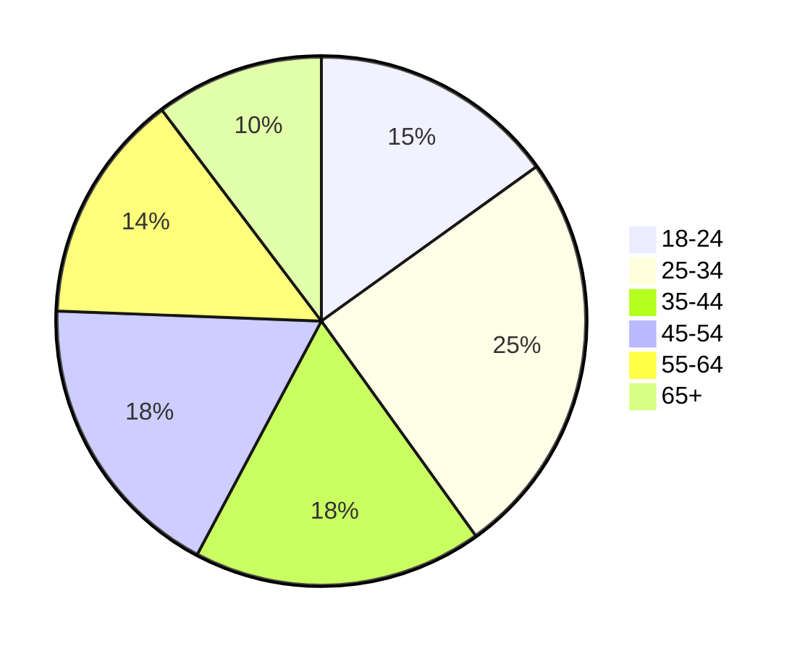

# Avito

## Содержание

- [Avito](#avito)
  - [Содержание](#содержание)
  - [Основная часть](#основная-часть)
    - [1. Тема и целевая аудитория](#1-тема-и-целевая-аудитория)
      - [Функционал MVP](#функционал-mvp)
      - [Ключевые продуктовые решения](#ключевые-продуктовые-решения)
      - [Целевая аудитория](#целевая-аудитория)
        - [Анализ трафика и вовлеченности](#анализ-трафика-и-вовлеченности)
        - [Веб-трафик по странам](#веб-трафик-по-странам)
        - [Демографические показатели](#демографические-показатели)
          - [Распределение по полу](#распределение-по-полу)
          - [Возрастной состав](#возрастной-состав)
        - [Устройства](#устройства)
  - [Список источников](#список-источников)

## Основная часть

### 1. Тема и целевая аудитория

**Avito** - интернет-сервис для размещения объявлений о товарах, недвижимости, а также услугах от частных лиц и компаний, занимающий первое место в мирое среди сайтов объявлений.

#### Функционал MVP

1. Регистрация и авторизация пользователей
2. Размещение и редактирование объявлений (фото, выбор категории, описание, цена)
3. Создание отзыва о продавце/покупателе
4. Модерация текста и фотографий объявлений/отзывов с использованием ML-модели для автоматического выявления нарушений
5. Чат между покупателем и продавцом (отправка текста, прикрепление фотографий, получение и просмотр сообщений)
6. Поиск товара/услуги по параметрам через
   - полнотекстовый поиск
   - категории
   - город
7. Индивидуальные рекомендации объявлений исходя из
   - объявлений, добавленных в избранное
   - объявлений, оцененных пользователем (поставил лайк)
   - оформленных покупок
   - поисковых запросов
   - региона и геолокации пользователя

#### Ключевые продуктовые решения

- Поиск объявлений товаров/услуг по картинке, используя ML-модель
- Добавление объявлений в избранное для их дальнейшего отслеживания
- Возможность поставить лайк на объявление, чтобы оценить товар/услугу и помочь рекомендательным алгоритмам

#### Целевая аудитория

##### Анализ трафика и вовлеченности

- 62.3M Monthly Active Users (MAU) [^1]
- 24.8M Daily Active Users (DAU) [^2]
- 400К новых объявлений в день [^2]
- 120 сделок в минуту [^1]
- более 230M активных объявлений [^1]

##### Веб-трафик по странам

|  **№**  | **Страна**     | **Пользователи** |
| :-----: | -------------- | ---------------- |
| 1 | Россия | 96.7% |
| 2 | Германия | 0.5% |
| 3 | Беларусь | 0.42% |
| 4 | Нидерланды | 0.36% |

##### Демографические показатели

###### Распределение по полу

- Мужчины: **64.11%** [^3]
- Женщины: **35.89%** [^3]

###### Возрастной состав

##### Устройства

- Десктоп: **29%** [^4]
- Мобильный: **71%** [^4]

## Список источников

[^1]: [Avito Career](https://career.avito.com/)

[^2]: [Avito Product Bootcamp 2024](https://vc.ru/u/742522-vadim-novikov/1087543-avito-product-bootcamp-2024)

[^3]: [Similar Web](https://www.similarweb.com/ru/website/avito.ru/)

[^4]: [Avito Club](https://avito-club.ru/archives/224)
