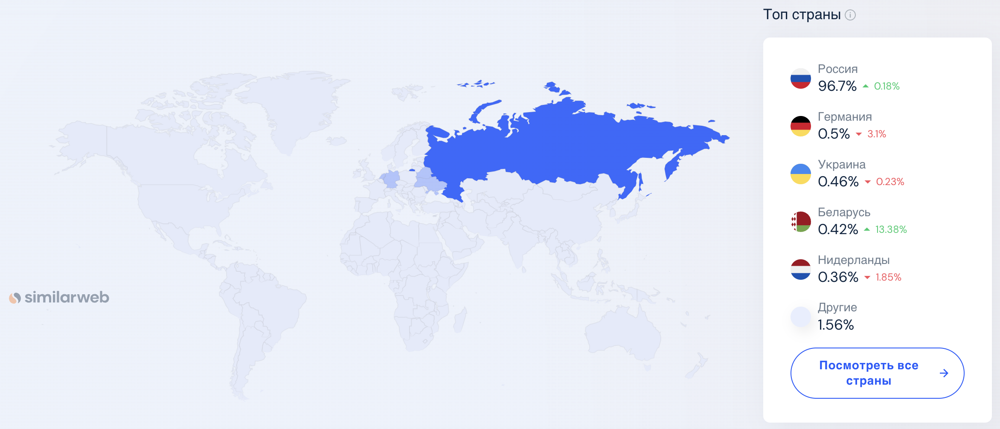
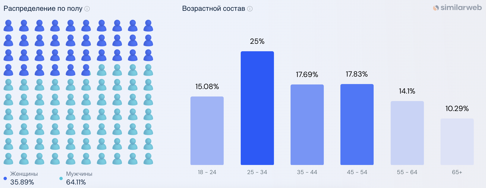

# Avito

## Содержание

- [Avito](#avito)
  - [Содержание](#содержание)
  - [Основная часть](#основная-часть)
    - [1. Тема и целевая аудитория](#1-тема-и-целевая-аудитория)
      - [Функционал MVP](#функционал-mvp)
      - [Целевая аудитория](#целевая-аудитория)
        - [Анализ трафика и вовлеченности](#анализ-трафика-и-вовлеченности)
        - [Веб-трафик по странам](#веб-трафик-по-странам)
        - [Демографические показатели](#демографические-показатели)
  - [Список источников](#список-источников)

## Основная часть

### 1. Тема и целевая аудитория

Avito - сервис, где каждый может предложить или найти товар или услугу.

#### Функционал MVP

1. регистрация и авторизация пользователей
2. размещение и редактирование объявлений (фото, выбор категории, описание, цена, выбор доставки)
3. добавление отзыва о продавце или покупателе
4. модерация объявлений (текста и фотографий) и отзывов
5. чат между покупателем и продавцом (отправка, получение и просмотр сообщений)
6. поиск товара или услуги по параметрам через
   - полнотекстовый поиск
   - категории
   - карты
7. просмотр рекомендаций товаров и услуг

#### Целевая аудитория

##### Анализ трафика и вовлеченности

- всего посещений (за месяц): **310.5M** [^1]
- доля пользователей, покинувших сайт после просмотра одной страницы: **25.11%** [^1]
- страниц на посещение: **12.80** [^1]
- средняя продолжительность посещения: **00:11:29** [^1]
- 53 млн активных пользователей в месяц [^2]
- **63%** продавцов Avito договариваются с клиентами устно или в переписке [^2]
- Avito посещают **36%** россиян каждый месяц [^2]

##### Веб-трафик по странам

 [^2]

##### Демографические показатели

 [^2]

## Список источников

[^1]: [Анализ веб-трафика avito.ru](https://www.similarweb.com/ru/website/avito.ru)

[^2]: [Статистика Avito за 2024 год](https://inclient.ru/avito-stats/)
