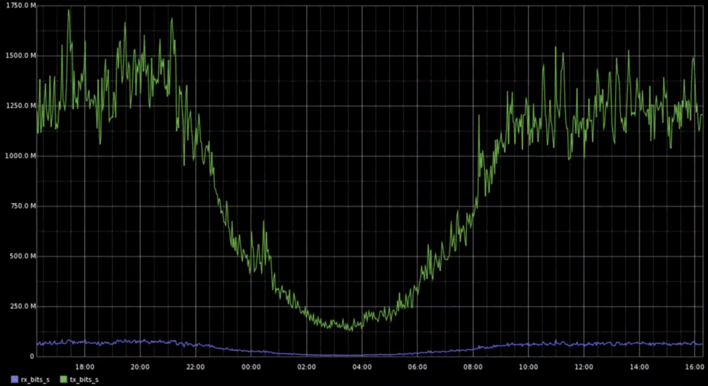
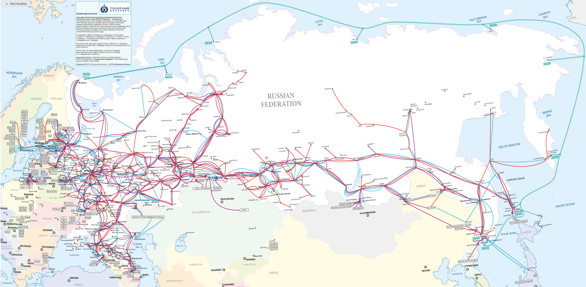

# Avito

## Содержание

- [Avito](#avito)
  - [Содержание](#содержание)
  - [Основная часть](#основная-часть)
    - [1. Тема и целевая аудитория](#1-тема-и-целевая-аудитория)
      - [Функционал MVP](#функционал-mvp)
      - [Ключевые продуктовые решения](#ключевые-продуктовые-решения)
      - [Целевая аудитория](#целевая-аудитория)
        - [Анализ трафика](#анализ-трафика)
        - [Веб-трафик по странам](#веб-трафик-по-странам)
        - [Демографические показатели](#демографические-показатели)
          - [Распределение по полу](#распределение-по-полу)
          - [Возрастной состав](#возрастной-состав)
        - [Устройства](#устройства)
    - [2. Расчет нагрузки](#2-расчет-нагрузки)
      - [Продуктовые метрики](#продуктовые-метрики)
        - [Предположения о продукте](#предположения-о-продукте)
        - [Средний размер хранилища одного пользователя](#средний-размер-хранилища-одного-пользователя)
          - [Пояснения](#пояснения)
          - [Результаты](#результаты)
      - [Технические метрики](#технические-метрики)
        - [RPS по типам запросов](#rps-по-типам-запросов)
          - [Пояснения](#пояснения-1)
        - [Нагрузка на сеть по типам запросов](#нагрузка-на-сеть-по-типам-запросов)
          - [Результаты](#результаты-1)
    - [3. Глобальная балансировка нагрузки](#3-глобальная-балансировка-нагрузки)
      - [Расположение дата-центров](#расположение-дата-центров)
      - [Распределение нагрузки по дата-центрам](#распределение-нагрузки-по-дата-центрам)
      - [Latency-Based DNS](#latency-based-dns)
      - [BGP Anycast](#bgp-anycast)
      - [CDN](#cdn)
    - [4. Локальная балансировка нагрузки](#4-локальная-балансировка-нагрузки)
      - [Схемы балансировки для входящих и межсервисных запросов](#схемы-балансировки-для-входящих-и-межсервисных-запросов)
        - [Kubernetes](#kubernetes)
        - [Роутинг BGP](#роутинг-bgp)
        - [L7 балансировка](#l7-балансировка)
        - [Envoy](#envoy)
      - [Cхема отказоустойчивости](#cхема-отказоустойчивости)
      - [Нагрузка по терминации SSL](#нагрузка-по-терминации-ssl)
  - [Список источников](#список-источников)

## Основная часть

### 1. Тема и целевая аудитория

**Avito** - интернет-сервис для размещения объявлений о товарах, недвижимости, а также услугах от частных лиц и компаний, занимающий первое место в мирое среди сайтов объявлений.

#### Функционал MVP

1. Регистрация и авторизация пользователей
2. Размещение и редактирование объявлений (фото, выбор категории, описание, цена)
3. Создание отзыва о продавце/покупателе
4. Модерация текста и фотографий объявлений/отзывов с использованием ML-модели для автоматического выявления нарушений
5. Чат между покупателем и продавцом (отправка текста, прикрепление фотографий, получение и просмотр сообщений)
6. Поиск товара/услуги
   - по ключевым словам (полнотекстовый поиск)
   - по категориям
   - по геолокации
7. Рекомендации объявлений исходя из
   - объявлений, добавленных в избранное
   - объявлений, оцененных пользователем (поставил лайк)
   - оформленных покупок
   - поисковых запросов
   - региона и геолокации пользователя

#### Ключевые продуктовые решения

- Поиск объявлений товаров/услуг по картинке, используя ML-модель
- Добавление объявлений в избранное для их дальнейшего отслеживания
- Защита номера телефона продавца (переадресация звонка с виртуального телефонного номера продавца на реальный)

#### Целевая аудитория

##### Анализ трафика

- **62.3M** Monthly Active Users (MAU) [^1]
- **24.8M** Daily Active Users (DAU) [^2]
- **400К** новых объявлений в день [^2]
- **120** сделок в минуту [^1]
- более **230M** активных объявлений [^1]

##### Веб-трафик по странам

[^3]

| **№** | **Страна** | **Пользователи** |
| :-: | - | - |
| 1 | Россия | 96.7% |
| 2 | Германия | 0.5% |
| 3 | Беларусь | 0.42% |
| 4 | Нидерланды | 0.36% |

##### Демографические показатели

###### Распределение по полу

- Мужчины: **64.11%** [^3]
- Женщины: **35.89%** [^3]

###### Возрастной состав

[^3]

##### Устройства

- Десктоп: **22%** [^4]
- Мобильный: **78%** [^4]

### 2. Расчет нагрузки

#### Продуктовые метрики

| **Метрика** | **Значение** |
| - | - |
| MAU | 62.3M [^1] |
| DAU | 24.8M [^1] |
| Новых объявлений | 400K в день [^1] |
| Сделок | 120 в минуту [^1] |
| Активных объявлений | >230M [^1] |
| Картинок в хранилище | 28B [^5] |
| Модерация объявлений | 15M в день [^5] |
| Посещений avito.ru | 314M в месяц [^6] |
| Создается объявлений | 1.4M в день [^6] |
| Отправляется сообщений | 40K в минуту [^6] |
| Создается бесед | 10K в минуту [^6] |

##### Предположения о продукте

- Аватарку загружают **70%** MAU
  - в среднем одна аватарка формата **WEBP** в разрешении **256x256** весит примерно **15 КБ** (после обработки на сервере)
- На одного пользователя приходится **3** объявления в месяц
- К одному объявлению прикреплено **5** картинок фомрата **WEBP** объемом **50 КБ** (после обработки на сервере)
- Один пользователь в месяц оставляет
  - 5 отзывов о продавце/покупателе, содержащих **250** символов на русском языке в кодировке **utf-16**, где каждое весит **0.5 КБ**
  - 200 сообщений, содержащих **50** символов на русском языке в кодировке **utf-16**, где каждое весит **0.1 КБ**
- Каждый пользователь из DAU в среднем делает **7** поисковых запрсов в сутки
- Каждый пользователь из DAU посещает главную страницу **5** раз
- Отзыв о продавце/покупателе оставляет каждый **10-й** пользователь после совершения сделки
- Из **10** просмотренных объявлений пользователь откроет страницу отзывов **2** раза
- Количество регистраций составляет 5% от общего количества посещений (**314M** в месяц [^6])
- **15%** пользователям из DAU нужно авторизоваться
- Пользователь добавляет в избранное **1** объявление из **10** просмотренных
- **30%** отредактированных объявлений содержат **2** новые фотографии

##### Средний размер хранилища одного пользователя

| **Данные** | **Количество** | **Общий объем, Кб** |
| - | - | - |
| Информация о пользователе | 1 | 12 |
| Объявления | 5 | 756 |
| Отзывы | 5 | 2.5 КБ |
| Сообщения | 200 | 20 |

###### Пояснения

- Информация о пользователе
  - персональные данные: $1$ КБ
  - аватарка: $1 \times 0.7 \times 15 = 11$ КБ

- Объявление (3 на пользователя в месяц)
  - данные о товаре/услуге (описание, характеристики, адрес и т.д.): $3 \times 2 = 6$ КБ
  - картинки: $3 \times 5 \times 50 = 750$ КБ

- Отзывы (5 на пользователя в месяц)
  - текст: $5 \times 0.5 = 2.5$ КБ

- Сообщения (200 на пользователя в месяц)
  - текст: $200 \times 0.1 = 20$ КБ

###### Результаты

Тогда на одного пользователя потребуется **791 КБ** в месяц. При нагрузке в **62.3M MAU** необходимо **46 ТБ** памяти в месяц.

За год сервис накопит данных объемом **550 ТБ**.

#### Технические метрики

##### RPS по типам запросов

| **Действие** | **Количество на пользователя в сутки** | **Общее количество в сутки** | **Среднее RPS** | **Пиковое RPS** |
| - | :-: | :-: | :-: | :-: |
| Регистрация | 0.02 | 507K | 5.9 | 17.6 |
| Авторизация | 0.015 | 3.7M | 43 | 129 |
| Создание объявления | 0.7 | 1.4M | 16 | 48 |
| Редактирование объявления | 6 | 13.6M | 157 | 471 |
| Поиск товара/услуги | 7 | 137.6M | 1592 | 4776 |
| Получение рекомендаций | 5 | 124M | 1435 | 4305 |
| Просмотр объявления | 10 | 248M | 2870 | 8610 |
| Добавить объявление в избранное | 1 | 24.8M | 287 | 861 |
| Создание отзыва о продавце/покупателе | 0.001 | 34.6K | 0.4 | 1.2 |
| Просмотр отзывов о продавце/покупателе | 2 | 49.6M | 574 | 1722 |
| Отправка сообщения в чате | 7 | 160M | 1852 | 5556 |
| Получение сообщения в чате | 7 | 160M | 1852 | 5556 |

###### Пояснения

При расчете используются [предположения об использовании продукта](#предположения-о-продукте).

Ниже представлен график RPS сервиса VK Видео, пользователи которого преимущественно из России, как и пользователи Avito, поэтому при рассчетах нагрузки будет считать, что пиковое RPS примерно в **3** раза больше среднего.

- Редактирование объявлений
  - **15M** версий объявлений в день проходят модерацию
  - если из **15M** версий объявлений вычесть число созданных объявлений (**1.4M** объявлений в день), получим **13.6M** объявлений

- Получение рекомендаций
  - показываем рекомендации на главной странице
  - каждый пользователь из DAU посещает главную страницу **5** раз в сутки

- Просмотр объявления
  - считаем, что из **7** поисковых запросов пользователь зайдет на **10** объявлений

- Создание отзыва о продаце/покупателе
  - каждую минуту совершается **120** сделок
  - каждый **10-й** пользователь из оставляет отзыв
  - сделка совершается между двумя пользователями, поэтому из **240** пользователей в минуту напишут **24** отзыва

##### Нагрузка на сеть по типам запросов

Значение объема трафика на одно действие было получено при помощи инструментов разработчика в браузере.

| **Действие** | **Трафик на одно действие, Кб** | **Среднее потребление, Гбит/сек** | **Пиковое потребление, Гбит/сек** | **Суммарный суточный трафик, Тбайт/сутки** |
| - | :-: | :-: | :-: | :-: |
| Регистрация | 442 | 0.02 | 0.06 | 0.23 |
| Авторизация | 399 | 0.14 | 0.42 | 1.52 |
| Создание объявления | 6144 | 0.81 | 2.43 | 8.70 |
| Редактирование объявления | 1228 | 1.58 | 4.74 | 17.01 |
| Поиск товара/услуги | 474 | 6.2 | 18.6 | 66.76 |
| Получение рекомендаций | 350 | 4.1 | 12.3 | 44.44 |
| Просмотр объявления | 214 | 5.0 | 15.0 | 54.34 |
| Добавить объявление в избранное | 8 | 0.019 | 0.057 | 0.2 |
| Создание отзыва о продавце/покупателе | 3 | 0.00001 | 0.00003 | 0.0001 |
| Просмотр отзывов о продавце/покупателе | 176 | 0.83 | 2.49 | 8.94 |
| Отправка сообщения в чате | 1 | 0.002 | 0.006 | 0.16 |
| Получение сообщения в чате | 1 | 0.002 | 0.006 | 0.16 |

###### Результаты

- Суммарное среднее потребление: **18.70 Гбит/сек**
- Суммарное пиковое потребление: **56.11 Гбит/сек**
- Суммарный суточный трафик: **202.46 Тбайт/сутки**

### 3. Глобальная балансировка нагрузки

#### Расположение дата-центров

По [таблице расределения веб-трафика по странам](#веб-трафик-по-странам) имеем, что практически все пользователи сервиса [avito.ru](https://www.avito.ru/) находятся в России.

При расположении дата-центров будем учитывать количество активных объявлений по городам, которое можно получить при помощи поиска объявлений. Получим следующую таблицу с количеством активных объявлений, распределенных по некоторым из больших городов:

| **Город** | **Активные объявления** |
| - | :-: |
| Москва | [37.2M](https://www.avito.ru/moskva?geoCoords=55.755814%2C37.617635&radius=25&searchRadius=25) |
| Санкт-Петербург | [14.3M](https://www.avito.ru/sankt-peterburg?geoCoords=59.939095%2C30.315868&radius=25&searchRadius=25) |
| Ростов-на-Дону | [3.8M](https://www.avito.ru/rostov-na-donu?geoCoords=47.222543%2C39.718732&radius=25&searchRadius=25) |
| Новосибирск | [3.2M](https://www.avito.ru/novosibirsk?geoCoords=55.030199%2C82.920430&radius=25&searchRadius=25) |
| Иркутск | [1.5M](https://www.avito.ru/irkutsk?geoCoords=52.286387%2C104.280660&radius=25&searchRadius=25) |
| Хабаровск | [800K](https://www.avito.ru/habarovsk?geoCoords=48.480223%2C135.071917&radius=25&searchRadius=25) |

Кроме того, при расположении дата-центров будем опираться на плотность населения России [^8]. Существенная ее часть расположена в западной части страны, что влияет на количество активных объявлений в этой области и на общее количество RPS, исходящее из этого региона.

Карта магистральных сетей связи [^7] также играет большую роль при определении локации для дата-центра. Чтобы уменьшить задержку при использовании сервиса, будем располагать дата-центры вблизи больших магистральных сетей связи.

Наибольшее количество активных объявлений, а потому и наибольшее количество пользователей сервиса находятся в Москве и Санкт-Петербурге, поэтому в каждом из этих городов расположим по дата-центру.

Расположим также дата-центр в Ростове-на-Дону, чтобы она обслуживал всех клиентов из южной части России.

Пользователей из Новосибирска и Хабаровска и других городов Центральной и Восточной части России будет обслуживать дата-центр в Иркутске. Его должно быть достаточно, так как население в той части, значительно ниже. Кроме того, через Иркутск проходят несколько магистральных связей сети, что позволит достаточно эффективно отправлять/получать трафик из Новосибирска, Хабаровска и других больших городов.

Таким образом, получаем следующее расположение дата-центров:

#### Распределение нагрузки по дата-центрам

Исходя из количества активных объявлений в городе, в котором расположен дата-центр, а также близлежащих городов, получаем следующее распределение запросов по дата-центрам:

| Запрос | Москва, RPS | Санкт-Петербург, RPS | Ростов-на-Дону, RPS | Иркутск, RPS |
| - | :-: | :-: | :-: | :-: |
| Регистрация | 3.4 | 1.2 | 1.1 | 0.5 |
| Авторизация | 24.9 | 8.2 | 7.7 | 3.4|
| Создание объявления | 9.3 | 3.0 | 2.9 | 1.3 |
| Редактирование объявления | 91 | 30 | 28 | 13 |
| Поиск товара/услуги | 923 | 303 | 287 | 127 |
| Получение рекомендаций | 832 | 273 | 258 | 115 |
| Просмотр объявления | 1665 | 545 | 517 | 230 |
| Добавить объявление в избранное | 167 | 55 | 52 | 23 |
| Создание отзыва о продавце/покупателе | 0.2 | 0.08 | 0.07 | 0.03 |
| Просмотр отзывов о продавце/покупателе | 333 | 109 | 103 | 46 |
| Отправка сообщения в чате | 1074 | 352 | 333 | 148 |
| Получение сообщения в чате | 1074 | 352 | 333 | 148 |

#### Latency-Based DNS

Для балансировки пользователей по регионам используем Latency-Based DNS, чтобы определять местоположение пользователя в сети и направлять его в ближайший дата-центр с учетом задержки сети. Если ближайший датацентр перегружен или недоступен, запрос может быть перенаправлен в резервный регион.

#### BGP Anycast

Распределять запросы внутри региона будем с помощью BGP Anycast, который позволяет привязать к одному IP-адресу сети несколько линков протокола BGP, что позволит балансировать нагрузку и отправлять пользователей на ближайшие дата-центры с точки зрения маршрутизации, уменьшая задержки. Для выбора кратчайшего маршрута BGP Anycast использует метрики, учитывающие количество хопов до сети назначения.

#### CDN

Для кэширования и раздачи статики (картинки объявлений, автарки пользователей, js, html, css и т.д.) будем использовать CDN, инстансы которых расположим рядом с дата-центрами, чтобы снизить нагрузку на бэкенды. Это позволит ускорить загрузку страниц и уменьшить объем трафика, обрабатываемый серверами.

### 4. Локальная балансировка нагрузки

#### Схемы балансировки для входящих и межсервисных запросов

##### Kubernetes

Для оркестрации контейнеров используем kubernetes, а для обработки внешнего трафика - nginx ingress controller, который выполняет SSL-терминацию с использованием session tickets.

При запуске нового контейнера kubernetes добавляет его в реестр сервисов после успешного прохождения readiness-пробы.

Помимо service discovery, kubernetes обеспечивает автоматическое масштабирование (auto-scaling) и управляет развертыванием новых версий приложений с поддержкой canary deployment.

##### Роутинг BGP

На каждом узле kubernetes запускается экземпляр nginx ingress controller, который обрабатывает входящий трафик. Узлы соединены сетью внутри дата-центра и анонсируют общий виртуальный ip-адрес через протокол bgp, то есть используем bgp для балансировки от роутера до L7 балансировщиков. Располагаем балансировщики симметрично относительно топологии сети, чтобы у них был одинаковый вес и метрика, которую считает bgp.

##### L7 балансировка

Используем nginx ingress controller для обработки входящего https-трафика, выполняя ssl-терминацию и маршрутизацию запросов к нужным микросервисам на основе url и других параметров.

На балансировщике поддерживаем постоянные tcp-соединения с бэкендами, используя мультиплексирование. Это снижает нагрузку на серверы за счет переиспользования соединений, минимизирует накладные расходы на их установку и позволяет группировать http-запросы внутри одного tcp-соединения, оптимизируя сетевые ресурсы.

Для распределения нагрузки используем алгоритм round robin, который циклически отправляет новый запрос к следующему доступному серверу в списке.

##### Envoy

В каждом контейнере с микросервисом запускаем envoy в качестве sidecar-прокси, который балансирует трафик между сервисами внутри дата-центра, что позволяет не нагружать центральный балансировщик nginx ingress и отличать внутренний трафик от внешнего. Причем держим открытыми соединения на входе и на выходе, чтобы минимизировать ресурсы на установку соединений.

Если считать, что запрос внутри дата-центра идет 0.5 мс, то такая схема позволяет снизить задержку при межсервисном взаимодействии до 1 мс против 2 мс, если бы мы использовали центральный nginx ingress (что и для внешнего трафика) или дополнительный балансировщик для распределения нагрузки внутри сервиса.

Помимо балансировки, envoy берет на себя задачи трассировки запросов, логирования и других сетевых функций, разгружая основной контейнер и обеспечивая единый уровень управления трафиком.

#### Cхема отказоустойчивости

В случае отказа одного из балансировщиков, bgp перестает получать информацию о маршруте от недоступного узла, автоматически обновляя маршруты и перенаправляя трафик на другой балансировщик.

Если один из экземпляров сервиса выходит из строя, kubernetes автоматически пересоздаст контейнер, что минимизирует время простоя приложения и обеспечивает отказоустойчивость.

Kubernetes активно мониторит состояние контейнеров, удаляя те, которые не проходят healthcheck, и запускает новые экземпляры. Система проверяет их готовность через readiness пробу, и только после успешного прохождения этой проверки направляет на них трафик, что исключает попадание на неработающие или некорректно настроенные контейнеры.

#### Нагрузка по терминации SSL

Терминация ssl достаточно дорогая операция для cpu и требует 2 round-trip'а. Количество round-trip'ов для установки ssl можно снизить до 1, если использовать session tickets и кэшировать tls сессии на клиенте, поэтому на стороне nginx ingress контроллера включаем session tickets для повторного использования tls сеансов без полного tls handshake'а.

Для шифрования session ticket используется ключ шифрования сессий. Этот ключ общий для всех балансировщиков. Он используется, чтобы зашифровать содержимое session ticket, чтобы клиент мог безопасно хранить этот ticket и передавать его обратно серверу без риска его изменения. Сервер генерирует симметричный ключ для этой сессии и записывает его в session ticket, который сервер использует для восстановления сессии, когда клиент повторно подключается.

Итак, когда клиент отправляет серверу зашифрованный session ticket, сервер расшифровывает его с использованием ключа для шифрования ticket, и из этого расшифрованного ticket'а сервер восстанавливает симметричный ключ и другие параметры сессии.

## Список источников

[^1]: [Avito Career](https://career.avito.com/)

[^2]: [Avito Product Bootcamp 2024](https://vc.ru/u/742522-vadim-novikov/1087543-avito-product-bootcamp-2024)

[^3]: [Similar Web 2024](https://www.similarweb.com/ru/website/avito.ru/)

[^4]: [Avito B2B 2021](https://www.avito.ru/b2b/most-popular-classified/?ysclid=m7c6cp1fwl280594081)

[^5]: [Avito Playbook](https://github.com/avito-tech/playbook)

[^6]: [Inclient статистика 2024](https://inclient.ru/avito-stats/)

[^7]: [Магистральные сети связи в России](https://www.comnews.ru/content/230456/2023-12-20/2023-w51/1180/magistralnye-seti-svyazi-rossii-2023#map-section)

[^8]: [World Population Density](https://www.luminocity3d.org/WorldPopDen/#7/)
