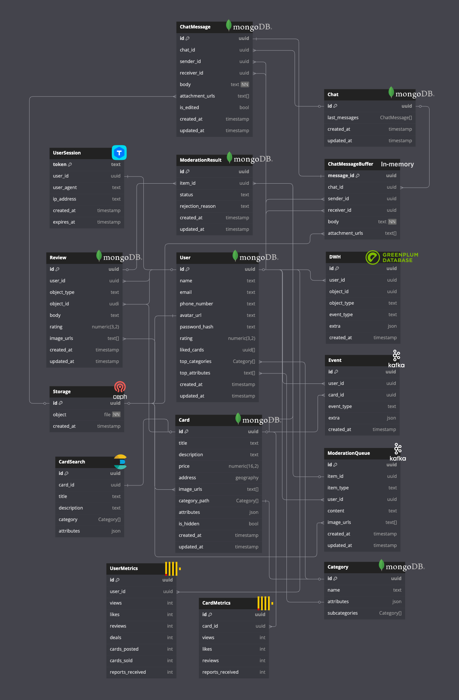

# Avito

## Содержание

- [Avito](#avito)
  - [Содержание](#содержание)
  - [Основная часть](#основная-часть)
    - [1. Тема и целевая аудитория](#1-тема-и-целевая-аудитория)
      - [Функционал MVP](#функционал-mvp)
      - [Ключевые продуктовые решения](#ключевые-продуктовые-решения)
      - [Целевая аудитория](#целевая-аудитория)
        - [Анализ трафика](#анализ-трафика)
        - [Веб-трафик по странам](#веб-трафик-по-странам)
        - [Демографические показатели](#демографические-показатели)
          - [Распределение по полу](#распределение-по-полу)
          - [Возрастной состав](#возрастной-состав)
        - [Устройства](#устройства)
    - [2. Расчет нагрузки](#2-расчет-нагрузки)
      - [Продуктовые метрики](#продуктовые-метрики)
        - [Предположения о продукте](#предположения-о-продукте)
        - [Средний размер хранилища одного пользователя](#средний-размер-хранилища-одного-пользователя)
          - [Пояснения](#пояснения)
          - [Результаты](#результаты)
      - [Технические метрики](#технические-метрики)
        - [RPS по типам запросов](#rps-по-типам-запросов)
          - [Пояснения](#пояснения-1)
        - [Нагрузка на сеть по типам запросов](#нагрузка-на-сеть-по-типам-запросов)
          - [Результаты](#результаты-1)
    - [3. Глобальная балансировка нагрузки](#3-глобальная-балансировка-нагрузки)
      - [Расположение дата-центров](#расположение-дата-центров)
      - [Распределение нагрузки по дата-центрам](#распределение-нагрузки-по-дата-центрам)
      - [Latency-Based DNS](#latency-based-dns)
      - [BGP Anycast](#bgp-anycast)
      - [CDN](#cdn)
    - [4. Локальная балансировка нагрузки](#4-локальная-балансировка-нагрузки)
      - [Схемы балансировки для входящих и межсервисных запросов](#схемы-балансировки-для-входящих-и-межсервисных-запросов)
        - [Kubernetes](#kubernetes)
        - [Роутинг BGP](#роутинг-bgp)
        - [L7 балансировка](#l7-балансировка)
        - [Envoy](#envoy)
      - [Cхема отказоустойчивости](#cхема-отказоустойчивости)
      - [Терминация SSL](#терминация-ssl)
    - [5. Логическая схема БД](#5-логическая-схема-бд)
      - [Логическая схема](#логическая-схема)
      - [Описание таблиц](#описание-таблиц)
      - [Размеры данных и нагрузки на чтение/запись](#размеры-данных-и-нагрузки-на-чтениезапись)
      - [Требования к консистентности](#требования-к-консистентности)
        - [Strong consistency](#strong-consistency)
        - [Eventual consistency](#eventual-consistency)
      - [Особенности распределения нагрузки по ключам](#особенности-распределения-нагрузки-по-ключам)
    - [6. Физическая схема БД](#6-физическая-схема-бд)
      - [Физическая схема](#физическая-схема)
      - [Выбор СУБД](#выбор-субд)
      - [Индексы](#индексы)
      - [Денормализация](#денормализация)
      - [Шардирование СУБД](#шардирование-субд)
      - [Резервирование СУБД](#резервирование-субд)
      - [Клиентские библиотеки и интеграции](#клиентские-библиотеки-и-интеграции)
      - [Балансировка запросов и мультиплексирование соединение](#балансировка-запросов-и-мультиплексирование-соединение)
      - [Схема резервного копирования](#схема-резервного-копирования)
    - [7. Алгоритмы](#7-алгоритмы)
      - [Поиск объявлений рядом с пользователем](#поиск-объявлений-рядом-с-пользователем)
        - [R-дерево](#r-дерево)
        - [H3](#h3)
      - [Обнаружение мошенников](#обнаружение-мошенников)
        - [Rule Engine](#rule-engine)
        - [Decision Tree](#decision-tree)
        - [Graph Model](#graph-model)
      - [Поиск по объявлениям](#поиск-по-объявлениям)
        - [BM25](#bm25)
        - [N-граммы](#n-граммы)
    - [8. Технологии](#8-технологии)
      - [Языки](#языки)
      - [Базы данных и хранилища](#базы-данных-и-хранилища)
      - [DevOps](#devops)
      - [Инфраструктура](#инфраструктура)
      - [Мониторинг](#мониторинг)
      - [Тестирование](#тестирование)
      - [ML](#ml)
      - [Дебаг и отладка](#дебаг-и-отладка)
      - [Другое](#другое)
    - [9. Схема проекта](#9-схема-проекта)
  - [Список источников](#список-источников)

## Основная часть

### 1. Тема и целевая аудитория

**Avito** - интернет-сервис для размещения объявлений о товарах, недвижимости, а также услугах от частных лиц и компаний, занимающий первое место в мирое среди сайтов объявлений.

#### Функционал MVP

1. Регистрация и авторизация пользователей
2. Размещение и редактирование объявлений (фото, выбор категории, описание, цена)
3. Создание отзыва о продавце/покупателе
4. Модерация текста и фотографий объявлений/отзывов с использованием ML-модели для автоматического выявления нарушений
5. Чат между покупателем и продавцом (отправка текста, прикрепление фотографий, получение и просмотр сообщений)
6. Поиск товара/услуги
   - по ключевым словам (полнотекстовый поиск)
   - по категориям
   - по геолокации
7. Рекомендации объявлений исходя из
   - объявлений, добавленных в избранное
   - объявлений, оцененных пользователем (поставил лайк)
   - оформленных покупок
   - поисковых запросов
   - региона и геолокации пользователя

#### Ключевые продуктовые решения

- Поиск объявлений товаров/услуг по картинке, используя ML-модель
- Добавление объявлений в избранное для их дальнейшего отслеживания
- Защита номера телефона продавца (переадресация звонка с виртуального телефонного номера продавца на реальный)

#### Целевая аудитория

##### Анализ трафика

- **62.3M** Monthly Active Users (MAU) [^1]
- **24.8M** Daily Active Users (DAU) [^2]
- **400К** новых объявлений в день [^2]
- **120** сделок в минуту [^1]
- более **230M** активных объявлений [^1]

##### Веб-трафик по странам

[^3]

| **№** | **Страна** | **Пользователи** |
| :-: | - | - |
| 1 | Россия | 96.7% |
| 2 | Германия | 0.5% |
| 3 | Беларусь | 0.42% |
| 4 | Нидерланды | 0.36% |

##### Демографические показатели

###### Распределение по полу

- Мужчины: **64.11%** [^3]
- Женщины: **35.89%** [^3]

###### Возрастной состав

[^3]

##### Устройства

- Десктоп: **22%** [^4]
- Мобильный: **78%** [^4]

### 2. Расчет нагрузки

#### Продуктовые метрики

| **Метрика** | **Значение** |
| - | - |
| MAU | 62.3M [^1] |
| DAU | 24.8M [^1] |
| Новых объявлений | 400K в день [^1] |
| Сделок | 120 в минуту [^1] |
| Активных объявлений | >230M [^1] |
| Картинок в хранилище | 28B [^5] |
| Модерация объявлений | 15M в день [^5] |
| Посещений avito.ru | 314M в месяц [^6] |
| Создается объявлений | 1.4M в день [^6] |
| Отправляется сообщений | 40K в минуту [^6] |
| Создается бесед | 10K в минуту [^6] |

##### Предположения о продукте

- Аватарку загружают **70%** MAU
  - в среднем одна аватарка формата **WEBP** в разрешении **256x256** весит примерно **15 КБ** (после обработки на сервере)
- На одного пользователя приходится **3** объявления в месяц
- К одному объявлению прикреплено **5** картинок фомрата **WEBP** объемом **50 КБ** (после обработки на сервере)
- Один пользователь в месяц оставляет
  - 5 отзывов о продавце/покупателе, содержащих **250** символов на русском языке в кодировке **utf-16**, где каждое весит **0.5 КБ**
  - 200 сообщений, содержащих **50** символов на русском языке в кодировке **utf-16**, где каждое весит **0.1 КБ**
- Каждый пользователь из DAU в среднем делает **7** поисковых запрсов в сутки
- Каждый пользователь из DAU посещает главную страницу **5** раз
- Отзыв о продавце/покупателе оставляет каждый **10-й** пользователь после совершения сделки
- Из **10** просмотренных объявлений пользователь откроет страницу отзывов **2** раза
- Количество регистраций составляет 5% от общего количества посещений (**314M** в месяц [^6])
- **15%** пользователям из DAU нужно авторизоваться
- Пользователь добавляет в избранное **1** объявление из **10** просмотренных
- **30%** отредактированных объявлений содержат **2** новые фотографии

##### Средний размер хранилища одного пользователя

| **Данные** | **Количество** | **Общий объем, Кб** |
| - | - | - |
| Информация о пользователе | 1 | 12 |
| Объявления | 5 | 756 |
| Отзывы | 5 | 2.5 КБ |
| Сообщения | 200 | 20 |

###### Пояснения

- Информация о пользователе
  - персональные данные: $1$ КБ
  - аватарка: $1 \times 0.7 \times 15 = 11$ КБ

- Объявление (3 на пользователя в месяц)
  - данные о товаре/услуге (описание, характеристики, адрес и т.д.): $3 \times 2 = 6$ КБ
  - картинки: $3 \times 5 \times 50 = 750$ КБ

- Отзывы (5 на пользователя в месяц)
  - текст: $5 \times 0.5 = 2.5$ КБ

- Сообщения (200 на пользователя в месяц)
  - текст: $200 \times 0.1 = 20$ КБ

###### Результаты

Тогда на одного пользователя потребуется **791 КБ** в месяц. При нагрузке в **62.3M MAU** необходимо **46 ТБ** памяти в месяц.

За год сервис накопит данных объемом **550 ТБ**.

#### Технические метрики

##### RPS по типам запросов

| **Действие** | **Количество на пользователя в сутки** | **Общее количество в сутки** | **Среднее RPS** | **Пиковое RPS** |
| - | :-: | :-: | :-: | :-: |
| Регистрация | 0.02 | 507K | 5.9 | 17.6 |
| Авторизация | 0.015 | 3.7M | 43 | 129 |
| Создание объявления | 0.7 | 1.4M | 16 | 48 |
| Редактирование объявления | 6 | 13.6M | 157 | 471 |
| Поиск товара/услуги | 7 | 137.6M | 1592 | 4776 |
| Получение рекомендаций | 5 | 124M | 1435 | 4305 |
| Просмотр объявления | 10 | 248M | 2870 | 8610 |
| Добавить объявление в избранное | 1 | 24.8M | 287 | 861 |
| Создание отзыва о продавце/покупателе | 0.005 | 173K | 2 | 6 |
| Просмотр отзывов о продавце/покупателе | 2 | 49.6M | 574 | 1722 |
| Отправка сообщения в чате | 7 | 160M | 1852 | 5556 |
| Получение сообщения в чате | 7 | 160M | 1852 | 5556 |

###### Пояснения

При расчете используются [предположения об использовании продукта](#предположения-о-продукте).

Ниже представлен график RPS сервиса VK Видео, пользователи которого преимущественно из России, как и пользователи Avito, поэтому при рассчетах нагрузки будет считать, что пиковое RPS примерно в **3** раза больше среднего.

- Редактирование объявлений
  - **15M** версий объявлений в день проходят модерацию
  - если из **15M** версий объявлений вычесть число созданных объявлений (**1.4M** объявлений в день), получим **13.6M** объявлений

- Получение рекомендаций
  - показываем рекомендации на главной странице
  - каждый пользователь из DAU посещает главную страницу **5** раз в сутки

- Просмотр объявления
  - считаем, что из **7** поисковых запросов пользователь зайдет на **10** объявлений

- Создание отзыва о продаце/покупателе
  - каждую минуту совершается **120** сделок
  - каждый **10-й** пользователь из оставляет отзыв
  - сделка совершается между двумя пользователями, поэтому из **240** пользователей в минуту напишут **24** отзыва

##### Нагрузка на сеть по типам запросов

Значение объема трафика на одно действие было получено при помощи инструментов разработчика в браузере.

| **Действие** | **Трафик на одно действие, Кб** | **Среднее потребление, Гбит/сек** | **Пиковое потребление, Гбит/сек** | **Суммарный суточный трафик, Тбайт/сутки** |
| - | :-: | :-: | :-: | :-: |
| Регистрация | 442 | 0.02 | 0.06 | 0.23 |
| Авторизация | 399 | 0.14 | 0.42 | 1.52 |
| Создание объявления | 6144 | 0.81 | 2.43 | 8.70 |
| Редактирование объявления | 1228 | 1.58 | 4.74 | 17.01 |
| Поиск товара/услуги | 474 | 6.2 | 18.6 | 66.76 |
| Получение рекомендаций | 350 | 4.1 | 12.3 | 44.44 |
| Просмотр объявления | 214 | 5.0 | 15.0 | 54.34 |
| Добавить объявление в избранное | 8 | 0.019 | 0.057 | 0.2 |
| Создание отзыва о продавце/покупателе | 3 | 0.00005 | 0.00015 | 0.0005 |
| Просмотр отзывов о продавце/покупателе | 176 | 0.83 | 2.49 | 8.94 |
| Отправка сообщения в чате | 1 | 0.002 | 0.006 | 0.16 |
| Получение сообщения в чате | 1 | 0.002 | 0.006 | 0.16 |

###### Результаты

- Суммарное среднее потребление: **18.70 Гбит/сек**
- Суммарное пиковое потребление: **56.11 Гбит/сек**
- Суммарный суточный трафик: **202.46 Тбайт/сутки**

### 3. Глобальная балансировка нагрузки

#### Расположение дата-центров

По [таблице расределения веб-трафика по странам](#веб-трафик-по-странам) имеем, что практически все пользователи сервиса [avito.ru](https://www.avito.ru/) находятся в России.

При расположении дата-центров будем учитывать количество активных объявлений по городам, которое можно получить при помощи поиска объявлений. Получим следующую таблицу с количеством активных объявлений, распределенных по некоторым из больших городов:

| **Город** | **Активные объявления** |
| - | :-: |
| Москва | [37.2M](https://www.avito.ru/moskva?geoCoords=55.755814%2C37.617635&radius=25&searchRadius=25) |
| Санкт-Петербург | [14.3M](https://www.avito.ru/sankt-peterburg?geoCoords=59.939095%2C30.315868&radius=25&searchRadius=25) |
| Ростов-на-Дону | [3.8M](https://www.avito.ru/rostov-na-donu?geoCoords=47.222543%2C39.718732&radius=25&searchRadius=25) |
| Новосибирск | [3.2M](https://www.avito.ru/novosibirsk?geoCoords=55.030199%2C82.920430&radius=25&searchRadius=25) |
| Иркутск | [1.5M](https://www.avito.ru/irkutsk?geoCoords=52.286387%2C104.280660&radius=25&searchRadius=25) |
| Хабаровск | [800K](https://www.avito.ru/habarovsk?geoCoords=48.480223%2C135.071917&radius=25&searchRadius=25) |

Кроме того, при расположении дата-центров будем опираться на плотность населения России [^8]. Существенная ее часть расположена в западной части страны, что влияет на количество активных объявлений в этой области и на общее количество RPS, исходящее из этого региона.

Карта магистральных сетей связи [^7] также играет большую роль при определении локации для дата-центра. Чтобы уменьшить задержку при использовании сервиса, будем располагать дата-центры вблизи больших магистральных сетей связи.

Наибольшее количество активных объявлений, а потому и наибольшее количество пользователей сервиса находятся в Москве и Санкт-Петербурге, поэтому в каждом из этих городов расположим по дата-центру.

Расположим также дата-центр в Ростове-на-Дону, чтобы она обслуживал всех клиентов из южной части России.

Пользователей из Новосибирска и Хабаровска и других городов Центральной и Восточной части России будет обслуживать дата-центр в Иркутске. Его должно быть достаточно, так как население в той части, значительно ниже. Кроме того, через Иркутск проходят несколько магистральных связей сети, что позволит достаточно эффективно отправлять/получать трафик из Новосибирска, Хабаровска и других больших городов.

Таким образом, получаем следующее расположение дата-центров:

#### Распределение нагрузки по дата-центрам

Исходя из количества активных объявлений в городе, в котором расположен дата-центр, а также близлежащих городов, получаем следующее распределение запросов по дата-центрам:

| Запрос | Москва, RPS | Санкт-Петербург, RPS | Ростов-на-Дону, RPS | Иркутск, RPS |
| - | :-: | :-: | :-: | :-: |
| Регистрация | 3.4 | 1.2 | 1.1 | 0.5 |
| Авторизация | 24.9 | 8.2 | 7.7 | 3.4|
| Создание объявления | 9.3 | 3.0 | 2.9 | 1.3 |
| Редактирование объявления | 91 | 30 | 28 | 13 |
| Поиск товара/услуги | 923 | 303 | 287 | 127 |
| Получение рекомендаций | 832 | 273 | 258 | 115 |
| Просмотр объявления | 1665 | 545 | 517 | 230 |
| Добавить объявление в избранное | 167 | 55 | 52 | 23 |
| Создание отзыва о продавце/покупателе | 0.2 | 0.08 | 0.07 | 0.03 |
| Просмотр отзывов о продавце/покупателе | 333 | 109 | 103 | 46 |
| Отправка сообщения в чате | 1074 | 352 | 333 | 148 |
| Получение сообщения в чате | 1074 | 352 | 333 | 148 |

#### Latency-Based DNS

Для балансировки пользователей по регионам используем Latency-Based DNS, чтобы определять местоположение пользователя в сети и направлять его в ближайший дата-центр с учетом задержки сети. Если ближайший датацентр перегружен или недоступен, запрос может быть перенаправлен в резервный регион.

#### BGP Anycast

Распределять запросы внутри региона будем с помощью BGP Anycast, который позволяет привязать к одному IP-адресу сети несколько линков протокола BGP, что позволит балансировать нагрузку и отправлять пользователей на ближайшие дата-центры с точки зрения маршрутизации, уменьшая задержки. Для выбора кратчайшего маршрута BGP Anycast использует метрики, учитывающие количество хопов до сети назначения.

#### CDN

Для кэширования и раздачи статики (картинки объявлений, автарки пользователей, js, html, css и т.д.) будем использовать CDN, инстансы которых расположим рядом с дата-центрами, чтобы снизить нагрузку на бэкенды. Это позволит ускорить загрузку страниц и уменьшить объем трафика, обрабатываемый серверами.

### 4. Локальная балансировка нагрузки

#### Схемы балансировки для входящих и межсервисных запросов

##### Kubernetes

Для оркестрации контейнеров используем kubernetes, а для обработки внешнего трафика - nginx ingress controller, который выполняет SSL-терминацию с использованием session tickets.

При запуске нового контейнера kubernetes добавляет его в реестр сервисов после успешного прохождения readiness-пробы.

Помимо service discovery, kubernetes обеспечивает автоматическое масштабирование (auto-scaling) и управляет развертыванием новых версий приложений с поддержкой canary deployment.

##### Роутинг BGP

На каждом узле kubernetes запускается экземпляр nginx ingress controller, который обрабатывает входящий трафик. Узлы соединены сетью внутри дата-центра и анонсируют общий виртуальный ip-адрес через протокол bgp, то есть используем bgp для балансировки от роутера до L7 балансировщиков. Располагаем балансировщики симметрично относительно топологии сети, чтобы у них был одинаковый вес и метрика, которую считает bgp.

##### L7 балансировка

Используем nginx ingress controller для обработки входящего https-трафика, выполняя ssl-терминацию и маршрутизацию запросов к нужным микросервисам на основе url и других параметров.

На балансировщике поддерживаем постоянные tcp-соединения с бэкендами, используя мультиплексирование. Это снижает нагрузку на серверы за счет переиспользования соединений, минимизирует накладные расходы на их установку и позволяет группировать http-запросы внутри одного tcp-соединения, оптимизируя сетевые ресурсы.

Для распределения нагрузки используем алгоритм round robin, который циклически отправляет новый запрос к следующему доступному серверу в списке.

##### Envoy

В каждом контейнере с микросервисом запускаем envoy в качестве sidecar-прокси, который балансирует трафик между сервисами внутри дата-центра, что позволяет не нагружать центральный балансировщик nginx ingress и отличать внутренний трафик от внешнего. Причем держим открытыми соединения на входе и на выходе, чтобы минимизировать ресурсы на установку соединений.

Если считать, что запрос внутри дата-центра идет 0.5 мс, то такая схема позволяет снизить задержку при межсервисном взаимодействии до 1 мс против 2 мс, если бы мы использовали центральный nginx ingress (что и для внешнего трафика) или дополнительный балансировщик для распределения нагрузки внутри сервиса.

Помимо балансировки, envoy берет на себя задачи трассировки запросов, логирования и других сетевых функций, разгружая основной контейнер и обеспечивая единый уровень управления трафиком.

#### Cхема отказоустойчивости

В случае отказа одного из балансировщиков, bgp перестает получать информацию о маршруте от недоступного узла, автоматически обновляя маршруты и перенаправляя трафик на другой балансировщик.

Если один из экземпляров сервиса выходит из строя, kubernetes автоматически пересоздаст контейнер, что минимизирует время простоя приложения и обеспечивает отказоустойчивость.

Kubernetes активно мониторит состояние контейнеров, удаляя те, которые не проходят healthcheck, и запускает новые экземпляры. Система проверяет их готовность через readiness пробу, и только после успешного прохождения этой проверки направляет на них трафик, что исключает попадание на неработающие или некорректно настроенные контейнеры.

#### Терминация SSL

Терминация ssl достаточно дорогая операция для cpu и требует 2 round-trip'а. Количество round-trip'ов для установки ssl можно снизить до 1, если использовать session tickets и кэшировать tls сессии на клиенте, поэтому на стороне nginx ingress контроллера включаем session tickets для повторного использования tls сеансов без полного tls handshake'а.

Для шифрования session ticket используется ключ шифрования сессий. Этот ключ общий для всех балансировщиков. Он используется, чтобы зашифровать содержимое session ticket, чтобы клиент мог безопасно хранить этот ticket и передавать его обратно серверу без риска его изменения. Сервер генерирует симметричный ключ для этой сессии и записывает его в session ticket, который сервер использует для восстановления сессии, когда клиент повторно подключается.

Итак, когда клиент отправляет серверу зашифрованный session ticket, сервер расшифровывает его с использованием ключа для шифрования ticket, и из этого расшифрованного ticket'а сервер восстанавливает симметричный ключ и другие параметры сессии.

### 5. Логическая схема БД

#### Логическая схема

#### Описание таблиц

| **Таблица** | **Описание** |
| - | - |
| **User** | Данные пользователя, включая url аватарки |
| **Storage** | Хранит файлы и изображения, прикрепленные к объявлениям, отзывам, а также аватарки пользователей. Использует S3 хранилище |
| **UserSession** | Сессия пользователя |
| **Category** | Иерархическая структура категорий объявлений. Хранится в MongoDB. В поле `attributes` содержит специфичные характеристики товаров для каждой категории |
| **Card** | Объявления пользователей. Поле `image_urls` содержит массив url изображений, что позволяет избежать join'ов для их получения |
| **CardSearch** | Поисковый индекс объявлений. Обновляется асинхронно после изменения данных объявления. Использует Elasticsearch |
| **Review** | Отзывы пользователей, содержащие текст, оценку и список url изображений, прикрепленных к отзыву о продавце/покупателе |
| **Event** | Общая система, в которую записываются все события пользователей. Используется для аналитики |
| **DWH** | Хранит пользовательскую активность, которая используется для анализа |
| **UserMetrics** | Счетчики, связанные с пользователями |
| **CardMetrics** | Счетчики, связанные с объявленями |
| **ModerationQueue** | Очередь на модерацию текстов и изображений объявлений и отзывов |
| **ModerationResult** | Результаты модерации, включая статус (одобрено/отклонено) и причину отклонения |
| **Chat** | Основная информация о чате. Хранит несколько последних сообщений, чтобы сократить количество join'ов при получении данных о чате |
| **ChatMessage** | Сообщения чата, включая текст, ссылки на вложения и метаданные |
| **ChatMessageBuffer** | Буфер сообщений, используемый для ускорения обмена и уменьшения нагрузки на БД за счет временного хранения сообщений |

#### Размеры данных и нагрузки на чтение/запись

Значения RPS нагрузки на запись и на чтение к БД были получены путем суммирования RPS ключевых действий, которые используют одинаковые модели данных в БД и которые отраженны в таблице [RPS по типам запросов](#rps-по-типам-запросов).

| **Таблица** | **Объем записи, байт** | **Прирост данных за сутки, Гб** | **Нагрузка на запись, RPS** | **Нагрузка на чтение, RPS** |
| - | :-: | :-: | :-: | :-: |
| **User** | 256 | 0.12 | 6 | 43 |
| **Storage** | 30744 | 245 | 99 | 19903 |
| **UserSession** | 180 | 0.7 | 49 | 4164 |
| **Category** | 224 | 0 | 0 | 32 |
| **Card** | 1121 | 15.6 | 173 | 2870 |
| **CardSearch** | 580 | 8.1 | 173 | 1592 |
| **Review** | 447 | 0.07 | 2 | 1722 |
| **Event** | 116 | 44.3 | 4749 | 5000 |
| **DWH** | 116 | 44.3 | 4749 | 5000 |
| **UserMetrics** | 220 | 5.1 | 287 | 1435 |
| **CardMetrics** | 220 | 5.1 | 287 | 1435 |
| **ModerationQueue** | 874 | 12.2 | 173 | 200 |
| **ModerationResult** | 88 | 1.2 | 173 | 200 |
| **Chat** | 192 | 2.9 | 185 | 370 |
| **ChatMessage** | 121 | 18 | 1852 | 1852 |
| **ChatMessageBuffer** | 104 | 15.5 | 1852 | 1852 |

#### Требования к консистентности

##### Strong consistency

- Ссылка `avatar_url` на аватарку пользователя **User** должна быть синхронизирована с S3, то есть записываем url в БД только после успешной загрузки в S3 хранилище
- Список ссылок на изображения `image_urls` объявления **Card** и отзыва **Review** должен быть синхронизирован с S3, то есть записываем url в БД только после успешной загрузки в S3 хранилище
- Список ссылок на вложения `attachment_urls` сообщений **ChatMessage** должен быть синхронизирован с S3, то есть записываем url в БД только после успешной загрузки в S3 хранилище

##### Eventual consistency

- Допустимо асинхронное
  - удаление отзывов **Review** при удалении пользователя **User**
  - удаление отзывов **Review** и записи из поискового индекса **CardSearch** при удалении объявления **Card**
  - удаление файлов, изображений и аватарок в **Storage** в S3 при удалении пользователя **User**
  - удаление изображений объявления в S3 при удалении объявления **Card**
  - удаление изображений отзыва в S3 при удалении **Review**
  - обновление поискового индекса **CardSearch** при обновлении данных объявления **Card**
  - удаление сообщений **ChatMessage** при удалении пользователя **User**
  - удаление данных в **UserMetrics** и **CardMetrics** при удалении пользователя **User**

#### Особенности распределения нагрузки по ключам

Многие таблицы (**User**, **Card**, **Review**, **UserSession**, **UserMetrics**) используют `user_id` для связи с пользователем, что делает его ключевым параметром для масштабирования. Шардирование по `user_id` позволит равномерно распределить нагрузку между узлами.

**ChatMessage** шардируем по `chat_id`, чтобы все сообщения внутри одного чата находились в одном шарде. Это минимизирует межшардовые запросы и ускоряет выборку сообщений.

### 6. Физическая схема БД

#### Физическая схема

#### Выбор СУБД

| База данных | Сущности | Объяснение |
| - | - | - |
| **MongoDB** | User, Card, Review, Chat, ChatMessage, ModerationResult, Category | Поддерживает репликацию и шардинг для масштабирования |
| **Tarantool** | UserSession | Обеспечивает высокую производительность за счет in-memory хранения. Обладает большей надежностью, чем Redis, потому что не теряет данные при отключении питания. Позволяет гибко конфигурировать и модифицировать БД скриптами на lua |
| **Elasticsearch** | CardSearch | Оптимизирован под быстрый полнотекстовый поиск. Масштабируется горизонтально, поддерживает шардирование и репликацию |
| **Kafka** | Event, ModerationQueue | Поддержка pub/sub-модели. Можно хорошо горизонтально масштабироваться. Спокойно может выдерживать высокую нагрузку |
| **Clickhouse** | UserMetrics, CardMetrics | Оптимизирован для OLAP-запросов и работы с большими объемами данных. Поддерживает колоночное хранение, что делает запросы быстрее. Позволяет задавать ограничения на используемые вычислительные ресурсы для аналитиков, чтобы контролировать нагрузку на БД |
| **CEPH** | Storage | Легко масштабируется до петабайтных размеров. Поддерживает репликацию данных, в которой можно определить нужное количество копий файлов и области их хранения. Однако он не предоставляет rete-limit'ов на пользователя |
| **Greenplum** | DWH | Оптимизирован для хранения и обработки больших объемов данных (терабайты и более). Использует MPP-архитектуру (Massively Parallel Processing), которая позволяет распределять вычисления между несколькими узлами кластера, ускоряя аналитику |
| **In-memory** | ChatMessageBuffer | Храним данные в памяти микросервиса для наиболее быстрой раздачи сообщений из буфера |

#### Индексы

Для повышения эффективности поиска данных, нужно использовать строить индексы. Будем опираться на значения [RPS](#размеры-данных-и-нагрузки-на-чтениезапись). Нужно понимать, что для каждого индекса строится отдельная структура данных, которая может заметно увеличить общий объем данных.

- **User**
  - составной индекс `(email, password_hash)` для ускорения авторизации
  - составной индекс `(phone_number, password_hash)` для ускорения авторизации

- **Card**
  - индекс по поля `user_id` для получения объявлений определенного пользователя

- **Review**
  - индекс по `object_id` для получения отзывов об объекте

- **ChatMessage**
  - индекс по `chat_id` для выборки сообщений в чате

- **ModerationResult**
  - индекс по `item_id` для проверки статуса модерации объявления/отзыва
  - индекс по `status` для получения отклоненных/одобренных объектов

#### Денормализация

Для оптимизации запросов к БД некоторые поля были денормализованы, чтобы позволило снизить нагрузку на систему и избавиться от дорогих join'ов:

- поле `image_urls` у сущностей **User**, **Review**, **ModerationQueue** хранит массив ссылок на изобаржения, прикрепленные к объявлению или отзыву

- поле `attachment_urls` у сущностей **ChatMessage**, **ChatMessageBuffer** хранит массив ссылок на файлы, прикрепленные к сообщению в чате

- поле `rating` у сущности **User** имеет заранее предпосчитанное значение, что позволяет от join с отзывами и вычисления рейтинга при каждом отображении страницы объявления

- поле `liked_cards` у сущности **User** позволяет избавиться от join'а при отображении избранных объявлений

- поля `category_path` и `attributes` у сущности **Card** позволяеь избавиться от поиска категорий и характеристик объявления и существенно ускорить отображение объявления, потому что не нужно делать 2 тяжелых join'а

- поле `last_messages` у сущности `Chat` с последними отправленными сообщениями в чате позволяет быстро подгрузить сообщения при открытии чата

- поле `top_categories` у сущности `User` позволяет быстро получить входные данные для рекомендаций

- поле `top_attributes` у сущности `User` позволяет быстро получить входные данные для рекомендаций

#### Шардирование СУБД

Сущности **User**, **Card**, **UserSession**, **UserMetrics** шардируем по `user_id` с использованием хэширования. Хэширование по `user_id` позволяет равномерно распределить пользователей между шарами. Это гарантирует, что нагрузка будет распределена и предотвращает возможные горячие шарды.

Сущность **Review** шардируем по `object_id`, чтобы эффективно получать все отзывы/оценки, оставленные на `object_id` (нужно на странице объявления), но чтобы получить все отзывы/оценки конкретного пользователя придется обойти все шарды.

Для эффективного хранения и масштабирования чатов мы шардируем **Chat**, **ChatMessage** и **ChatMessageBuffer** по `chat_id`. Это гарантирует, что все сообщения одного чата попадут в один шард, что упрощает транзакции и поиск сообщений.

#### Резервирование СУБД

Поднимаем дополительный горячий инстанс БД, которая реплецириует данные с мастера. По умолчанию нагрузка на эту реплику не идет, но в случае отказа мастера или одной из реплик, эта БД становится новым мастером или репликой, на которую мы начинаем давать нагрузку.

#### Клиентские библиотеки и интеграции

Серверную часть приложения будем писать на Go.

- **MongoDB** - [mongo-go-driver](https://github.com/mongodb/mongo-go-driver)
  - официальный клиент
  - интеграция с функциями репликации и шардирования
  - поддерживает асинхронные операции с использованием context и async операций
  - предоставляет удобный интерфейс для работы с коллекциями и индексами

- **Tarantool** - [go-tarantool](https://github.com/tarantool/go-tarantool)
  - официальный клиент

- **Elasticsearch** - [go-elasticsearch](https://github.com/elastic/go-elasticsearch)
  - официальный клиент
  - поддерживает bulk-запросы, API управления индексами, поиск

- **Kafka** - [kafka-go](https://github.com/segmentio/kafka-go)
  - реализует протокол Kafka самостоятельно, без использования сторонних библиотек на C
  - встроенный балансировщик нагрузки для распределения сообщений по брокерам

- **Clickhouse** - [clickhouse-go](https://github.com/ClickHouse/clickhouse-go)
  - официальный драйвер
  - поддерживает асинхронный bulk insert

- **CEPH** - [go-ceph](https://github.com/ceph/go-ceph)
  - официальный клиент

- **Greenplum** - [pgx](https://github.com/jackc/pgx)
  - совместим с PostgreSQL, поддерживает работу с Greenplum
  - поддержка транзакций, подготовленных запросов, партиционирования
  - асинхронный ввод-вывод и эффективная работа с большими объемами данных

#### Балансировка запросов и мультиплексирование соединение

Для балансировки запросов и мультиплексирования соединений к MongoDB будем использовать MongoDB Connection Pooling.

MongoDB имеет встроенную поддержку пула соединений, который автоматически управляет многократными соединениями с базой данных, позволяя эффективно использовать ресурсы. Когда клиент делает запрос, пул выделяет одно из уже установленных соединений вместо того, чтобы открывать новое, что значительно снижает накладные расходы на создание соединений и повышает производительность при высокой нагрузке.

MongoDB Connection Pooling позволяет также контролировать количество одновременно открытых соединений, что помогает избегать перегрузки базы данных. Пул автоматически распределяет запросы между доступными соединениями, улучшая отклик и распределяя нагрузку на сервер.

#### Схема резервного копирования

Делать бэкапы на продовом инстансе БД нельзя, потому что чтобы сделать полный бэкап БД нужно остановить, что делать на продакшене нельзя, поэтому мы поднимаем дополнительную реплику. Если нужно сделать бэкап, то мы останавливаем эту реплику, делаем бэкап, заново запускаем реплику и, имея WAL мастера, догоняем его, реплецируя данные, которые были записаны в момент создания бэкапа.

- **MongoDB**
  - раз в сутки делаем полный физический бэкап, то есть копируем все файлы БД
  - раз в 6 часов делаем логический бэкап
  - раз в 10 минут делаем WAL Archiving, сохраняя WAL-файлы, что позволит в будущем восстановить БД до любого момента во времени (Point-in-Time Recovery)

- **Tarantool**
  - раз в 6 час делаем снапшот, созхраняя состояние БД
  - раз в 10 минут сохраняем WAL-файлы, что позволит докатить снапшот до определенного момента времени

- **Clickhouse**
  - хранит аналитические данные, поэтому раз в 6 часов делаем оптимизированные инкрементальные бэкапы
  - раз в сутки сохраняем снапшоты таблиц

- **CEPH**
  - используем Replicated Pool, чтобы хранить несколько копий объекта в разных узлах
  - раз в сутки делаем снапшот хранилища

- **Elasticsearch**
  - хранит поисковые индексы, которые можно восстановить из PostgreSQL, но чтобы избежать потерь, делаем снапшот раз в 6 часов, используя Snapshot API

- **Greenplum**
  - раз в сутки выполняем полный логический бэкап с помощью `gp_dump` и сохраняем его в CEPH
  - раз в 6 часов делаем инкрементальный бэкап с помощью `gp_dump --incremental`
  - раз в 10 минут сохраняем WAL-файлы, что позволяет выполнить Point-in-Time Recovery
  - в случае отказа кластера можно быстро развернуть новый инстанс и восстановить его из последнего полного бэкапа + WAL

### 7. Алгоритмы

#### Поиск объявлений рядом с пользователем

В Avito пользователи могут искать объявления вокруг себя среди более 190 миллионов активных объявлений, задавая разный радиус поиска (от 1 до 150 км), поэтому нужно выбрать алгоритм поиска по геолокации, который будет работать не только эффективно, но и будет масштабируем под такие объемы данных.

##### R-дерево

R-дерево — древовидная структура данных. Она подобна B-дереву, но используется для организации доступа к пространственным данным, то есть для индексации многомерной информации (географические данные с двумерными координатам).

Эта структура данных разбивает многомерное пространство на множество иерархически вложенных и, возможно, пересекающихся, прямоугольников.

Алгоритмы вставки и удаления используют эти ограничивающие прямоугольники для обеспечения того, чтобы "близкорасположенные" объекты были помещены в одну листовую вершину. Новый объект попадёт в ту листовую вершину, для которой потребуется наименьшее расширение её ограничивающего прямоугольника.

Прямоугольники используюутся как грубая фильтрация. На конечном этапе выполняется точное вычисление расстояния, что бывает затратно, потому что в прямоугольник может попасть много неподходящих объектов.

При частых изменениях данных (вставка или удаление объявлений) структура может требовать перестроения, поэтому она меньше подходит для динамичных приложений, где обновления происходят часто. Этот алгоритм полезен для поиска объектов в ограниченных географических областях, но не по всей России, тем более, если мы хотим, чтобы Avito работал и в других странах.

##### H3

H3 [^9] — это географическая система индексации, где поверхность Земли разделена на сетку равномерных шестиугольных ячеек. Эта система иерархическая, т.е. каждый шестиугольник на верхнем уровне может быть разделен на семь равномерных, но меньших, и так далее.

Пара широты и долготы может быть преобразована в 64-битный H3 индекс, идентифицирующий ячейку сетки. H3 индекс в первую очередь используется для группировки местоположений и других геопространственных манипуляций.

В Avito можно использовать сетку для группировки объявлений в шестиугольные области, ячейки, а затем выполнять поиск по таким группам. Форма ячейки имеет шестиугольную форму, потому что шестиугольники имеют только одно расстояние между центральной точкой шестиугольника и его соседями, по сравнению с двумя расстояниями для квадратов или тремя расстояниями для треугольников. Это свойство значительно упрощает выполнение поиска.

Уровень иерархии называется resolution и может принимать значение от 0 до 15, где 0 — это уровень base с самыми крупными и грубыми ячейками. Шестиугольники не могут быть идеально разделены на семь шестиугольников, поэтому более мелкие ячейки только приблизительно содержатся в родительской ячейке.

Система индексации H3 имеет [открытый исходный код](https://github.com/uber/h3) и предоставляет:

- api для индексации координат в шестиугольной сетке с точностью
- быстрое объединение и агрегация индексированных данных с разной степенью точности
- набор алгоритмов и оптимизаций на основе сетки, включая "ближайших соседей", "кратчайший путь", сглаживание градиента и другие
- есть функция, которая находит соседние шестиугольники для заданного идентификатора H3 и возвращает список их идентификаторов. Таким образом, можно быстро найти ближайшие объекты, используя идентификаторы H3 и список соседних шестиугольников

H3 лучше подходит по задачи поиска объявлений в заданном радиусе, потому что имеет меньше искажений, чем при использовании квадратных или прямоугольных ячеек и лучше масштабируется и эффективно работает с большими объемами данных.

#### Обнаружение мошенников

##### Rule Engine

Этот метод основан на наборе предопределённых правил, которые определяют мошенническое поведение. Например:

- использование одного и того же ip-адреса для создания множества аккаунтов
- чрезмерное количество однотипных объявлений за короткий период
- подозрительные схемы оплаты

Однако этот подход имеет ограничения: он эффективен только против известных мошеннических схем, но плохо выявляет новые или сложные схемы мошенничества.

##### Decision Tree

Принцип работы:

1. Собираются исторические данные о пользователях: количество объявлений, возраст аккаунта, ip-адреса, способы оплаты и т.д.
2. Строим дерево, где на каждом узле происходит разбиение по определённому признаку (например, возраст аккаунта).
3. Для нового пользователя алгоритм проходит по дереву, чтобы определить его класс

Алгоритм показывает хорошую эффективность, но сильно зависит от качества меток, по которым классифицируются данные, что трудно получить в реальной жизни, поэтому этот алгоритм тоже плохо работает на неизвестных схемах.

##### Graph Model

Строим сеть взаимосвязей между пользователями, устройствами, ip-адресами и объявлениями, выявляя подозрительные группы. Модель хорошо работает для обнаружения неизвестных случаев мошенничества с меньшей зависимостью от меток, поскольку она использует структурные корреляции на графе.

Мошенники часто связаны между собой: они используют одни и те же устройства, ip-адреса, контактные данные и методы оплаты. Эти связи образуют плотные кластеры в графе, что позволяет выявлять аномальные группы.

На изображении ниже красным выделены узлы, представляющие известных мошенников.

Этот алгоритм использует структурные корреляции в графе для выявления аномалий, меньше зависит от меток и размеченных данных и относительно легко обнаруживает сложные мошеннические схемы, которые не выявляются классическими алгоритмами.

Паттерны:

- если узел (пользователь) близко связан с уже известными мошенниками (через общие транзакции, IP-адреса, устройства), это подозрительный сигнал
- мошенники часто работают группами, создавая небольшие плотные кластеры
- боты часто имеют одинаковые паттерны поведения и соединены с одними и теми же узлами

#### Поиск по объявлениям

##### BM25

BM25 [^10] - функция ранжирования, используемая поисковыми системами для упорядочивания документов по их релевантности данному поисковому запросу.

Алгоритм включает несколько компонентов:

- если поисковый запрос составлен из нескольких элементов, то BM25 вычисляет отдельную численную оценку для каждого элемента, а затем суммирует их
- часто встречающиеся слова (например, "the" или "and") менее информативны, чем редкие, поэтому хотим повысить важность редких слов
- количество повторений элемента запроса в документе увеличивает вероятность того, что документ связан с элементом. При этом каждое повторение элемента вносит все меньший вклад
- в длинных документах количество повторений элемента может быть выше просто из-за их длины, но мы не хотим несправедливо отдавать предпочтение более длинным документам, поэтому BM25 применяет нормализацию на основании того, насколько длина документа соотносится со средней

Алгоритм эффективен в ранжировании документов и прост в реализации (даже можно настраивать влияние слова и длины документа на итоговый результат), но BM25 работает с отдельными терминами, не учитывает семантические связи между ними и порядок слов, что может влиять на релевантность результатов.

##### N-граммы

N-граммы [^11] - это статистические модели, которые предсказывают следующее слово после $N-1$ слов на основе вероятности их сочетания, то есть задача состоит в том, чтобы найти вероятность каждого следующего элемента в последовательности на основе предыдущих $N-1$ элементов. Например, сочетание I want to в английском языке имеет высокую вероятностью, а want I to – низкую.

Предположим, что мы обучили модель на тексте "мама мыла раму". Когда алгоритм видит слово "мама", он проверяет все биграммы, начинающиеся на "мама" (в данном случае только (мама, мыла)) и использует вероятность для предсказания следующего слова. Если же мы видим "мыла", то проверяем, что следующее слово в нашем тексте — "раму".

В отличие от BM25 учитывает последовательность слов, а также может находить фразы с замененными буквами или опечатками, но если встретится новая фраза, то ее N-грамма не будет найдена.

Размер модели растет экспоненциально. С увеличением N количество возможных N-грамм увеличивается экспоненциально. Например, для биграмм с словарём в 100k слов потребуется хранить до $10^{10}$ возможных пар слов.

### 8. Технологии

#### Языки

| Технология | Применение | Обоснование |
| - | - | - |
| Golang | Backend | Прост в использовании и эффективно работает на многоядерных серверах |
| Python | Машинное обучение, автоматизация | Много готовых библиотек для ML и удобен для быстрого прототипирования |
| Lua | Конфигурирование Tarantool | Встроен в Tarantool как основной язык конфигурации |
| TypeScript + React | Frontend | Статическая типизация и улучшенная читаемость по сравнению с JS |
| Swift | IOS | Основной язык разработки IOS приложений, рекомендованный Apple |
| Kotlin | Android | Основной язык разработки Android приложений |

#### Базы данных и хранилища

| Технология | Применение | Обоснование |
| - | - | - |
| MongoDB | Runtime БД | Подходит для runtime нагрузки, встроенное шардирование и документно-ориентированная модель |
| Tarantool | Хранение сессий | Быстрый in-memory движок с поддержкой Lua и персистентности |
| Clickhouse | Хранение метрик | Оптимизирован под эффективную работу с агрегациями и временными рядами |
| Greenplum | DWH | Подходит для сложной аналитики и обработки больших объемов данных благодаря MPP-архитектуре |
| ElasticSearch | Полнотекстовый посиск | Быстрый поиск по тексту, поддержка сложных запросов и фильтрации |
| CEPH | Хранение изображений, файлов, статики, бэкапов | Распределенное и отказоустойчивое хранилище с поддержкой масштабирования и дублирования данных |

#### DevOps

| Технология | Применение | Обоснование |
| - | - | - |
| Kubernetes | Оркестрация и утилизация ресурсов | Оркестрация сервисов, автоматическое масштабирование и восстановление после сбоев |
| Helm | Управление приложениями k8s | Упрощает процесс развертывания сложных приложений в k8s, управляет зависимостями этих пориложений, позволяет автоматически обновлять и отказывать приложения |
| Docker | Контейнеризация | Упрощает сборку, доставку и запуск приложений в изолированной среде |
| Self-Hosted Gitlab | Хранение репозиториев с кодом | Полный контроль над кодовой базой |
| Self-Hosted Gitlab Runners | CI/CD | Гибкая настройка CI/CD пайплайнов и поддержка изоляции окружений |
| Vault | Хранение секретов | Безопасное централизованное хранилище с гибкой системой доступа и аудитом |

#### Инфраструктура

| Технология | Применение | Обоснование |
| - | - | - |
| Envoy | Балансировка | Легко интегрируется с k8s, высокая производительность, поддержка gRPC и TLS, поддерживает динамическое обновление конфигурации |
| Istio | Service Mesh | Управляет сетевым взаимодействием между микросервисами без необходимости менять их код; работает через sidecar proxy - обычно это Envoy, который встраивается в каждый под Kubernetes |
| Kafka | Брокер сообщений | Хорошо справляется с высокой нагрузкой, легко масштабируется, подходит для event-driven архитектуры |

#### Мониторинг

| Технология | Применение | Обоснование |
| - | - | - |
| Prometheus | Сбор и хранение метрик | Поддерживает pull-модель, легко интегрируется с k8s и сервисами |
| Grafana | Визуализация метрик | Удобные дашборды с поддержкой алертов и плагинов |
| Loki | Сбор логов | Интеграция с Grafana, простой парсинг логов без необходимости сложной настройки |
| OpenTelemetry | Трейсинг | Стандартизованный сбор трейсинга, работает с множеством бэкендов и систем наблюдаемости |
| Prometheus Alertmanager | Реакция на инциденты | Автоматическая генерация алертов по метрикам, интеграция с slack, telegram, email |

#### Тестирование

| Технология | Применение | Обоснование |
| - | - | - |
| Selenium | E2E тестирование | Автоматизация браузерных тестов, поддержка различных браузеров |
| Allure Report | Генерация тестовых отчетов | Поддерживает интеграцию с фреймворками тестирования, интеграция с Gitlab CI/CD пайпланом |
| TestRail | TMS | Позволяет управлять процессами тестирования |

#### ML

| Технология | Применение | Обоснование |
| - | - | - |
| TensorFlow / PyTorch | Обучение и инференс моделей | Гибкие и мощные фреймворки с богатой экосистемой для разработки моделей |
| ONNX Runtime | Продакшен инференс моделей | Универсальный и высокопроизводительный runtime, позволяет использовать модели, обученные в разных фреймворках |
| LightGBM / XGBoost | Градиентный бустинг для табличных данных | Отлично подходит для обучения рекомендационных систем на поведенческих/метаданных, быстрый и точный |
| MLflow | Управление экспериментами | Хранение параметров моделей, метрик и артефактов, удобно для воспроизводимости и CI/CD моделей |
| Faiss | Быстрый поиск похожих объектов | Оптимизированная библиотека от Facebook для поиска ближайших соседей - используется в рекомендациях по похожим объявлениям |
| Kubeflow | ML-оркестрация / пайплайны | Нативная интеграция с K8S |

#### Дебаг и отладка

| Технология | Применение | Обоснование |
| - | - | - |
| Sentry | Ловля ошибок на фронтенде и бэкенде | Захватывает stack trace'ы, автоматически группирует баги и показывает, где они возникают |
| gdb / Delve | Отладка кода | gdb - классический отладчик, Delve - инструмент для отладки go приложений |
| pprof | Профилирование go приложений | Стандартный инструмент go для анализа cpu, памяти, блокировок и производительности |
| strace / lsof / tcpdump | Диагностика системных вызовов, сетевых проблем | Используются для анализа проблем с файловой системой, сетью и зависаниями |

#### Другое

| Технология | Применение | Обоснование |
| - | - | - |
| H3 | Поиск по геолокации | Библиотека предоставляет единую систему геолокации, позволяет эффективно искать по геолокации |

### 9. Схема проекта

## Список источников

[^1]: [Avito Career](https://career.avito.com/)

[^2]: [Avito Product Bootcamp 2024](https://vc.ru/u/742522-vadim-novikov/1087543-avito-product-bootcamp-2024)

[^3]: [Similar Web 2024](https://www.similarweb.com/ru/website/avito.ru/)

[^4]: [Avito B2B 2021](https://www.avito.ru/b2b/most-popular-classified/?ysclid=m7c6cp1fwl280594081)

[^5]: [Avito Playbook](https://github.com/avito-tech/playbook)

[^6]: [Inclient статистика 2024](https://inclient.ru/avito-stats/)

[^7]: [Магистральные сети связи в России](https://www.comnews.ru/content/230456/2023-12-20/2023-w51/1180/magistralnye-seti-svyazi-rossii-2023#map-section)

[^8]: [World Population Density](https://www.luminocity3d.org/WorldPopDen/#7/)

[^9]: [Hexagonal Hierarchical Geospatial Indexing System](https://www.uber.com/en-DE/blog/h3/)

[^10]: [BM25](https://ru.wikipedia.org/wiki/Okapi_BM25)

[^11]: [N-gram](https://habr.com/ru/articles/675218/)
